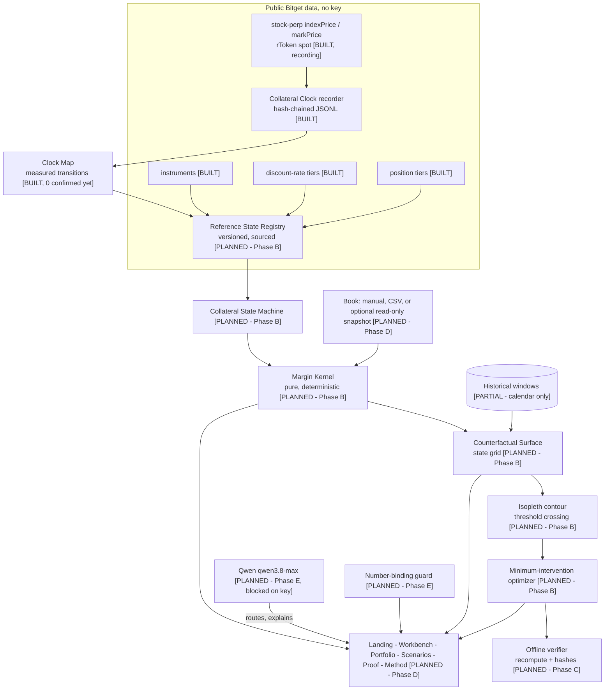

# ARCHITECTURE.md

The intended system architecture (from FINAL_INSTRUCTION.md §5), annotated
with what's actually built as of 2026-10-05 vs. still planned. Status tags:
**[BUILT]**, **[PARTIAL]**, **[PLANNED]**.



## Monorepo layout — actual vs. planned

```text
isopleth/
  FINAL_INSTRUCTION.md DISCOVERY.md TASK.md PROGRESS.md CLAIMS.json          [BUILT]
  EVIDENCE_MANIFEST.md PROOF.md METHOD.md LIMITATIONS.md CONTRIBUTIONS.md   [BUILT]
  ARCHITECTURE.md MILESTONE.md SUBMISSION.md README.md                     [BUILT]
  docs/
    sources/        [PLANNED - re-fetch of F1-F14, see LIMITATIONS.md]
    screens/        [PLANNED - Phase G]
    mcp-tools.json  [PLANNED - Phase A/E6, blocked on QWEN_API_KEY]
  packages/
    core/      [PLANNED - Phase B: types, state machine, margin kernel, surface, contour, optimizer]
    data/      [PARTIAL - client.ts, tick.ts, guards.ts built; no signer/parsers beyond this yet]
    evidence/  [PLANNED - Phase C: hash chain lives in packages/data/tick.ts for now, not yet its own package]
    qwen/      [PLANNED - Phase E, blocked on QWEN_API_KEY]
  apps/web/    [PLANNED - Phase D, Next.js 15 App Router]
  .github/workflows/
    recorder.yml   [BUILT, not yet pushed/enabled - reserved for the user]
    verify.yml     [PLANNED - Phase C]
  data/
    clock/     [BUILT - raw/, rules/, instruments-raw/, pairs.json, clock-map.json, e3-fallback-trap.json]
    windows/   [PARTIAL - window-set.json + pre-registration.md built; replay output not yet]
    rules/     [BUILT, see data/clock/rules/]
    bench/     [PLANNED - Phase C]
    break/     [PLANNED - Phase C]
    manifests/ [PLANNED - Phase C]
    calendar/  [BUILT - nyse-2026.json]
  public/
    img/       [BUILT - IMG_1_Hero.jpeg, IMG_2.jpeg, IMG_3.jpeg staged by user 2026-10-05,
                not yet wired into any route - see Phase D/F in TASK.md]
  scripts/
    discovery/ [BUILT - e1, e2 (x2), e3, e4, recorder-tick, segment-clock]
    bench.ts break.ts manifest.ts readme-numbers.ts  [PLANNED - Phase C]
  tests/       [PLANNED - unit/ property/ e2e/, Phase B onward]
```

## Stack — actual vs. planned

| Layer | Planned (§5.1) | Actual as of 2026-10-05 |
|---|---|---|
| Language | TypeScript strict | **[BUILT]** `tsconfig.json`, strict mode, `noUncheckedIndexedAccess`, `exactOptionalPropertyTypes` |
| Package manager | pnpm workspace | **[BUILT]** `pnpm-workspace.yaml` (`packages/*`, `apps/*`) |
| Validation | Zod at every boundary | **[PARTIAL]** installed, not yet used anywhere (no boundaries exist yet to validate — Phase B/D) |
| Testing | Vitest + fast-check | **[PARTIAL]** Vitest installed and wired (`pnpm test`); fast-check not installed yet (Phase B) |
| Web | Next.js 15 App Router, route handlers | **[PLANNED]** — Phase D |
| Rendering | hand-built SVG + d3-scale/d3-shape | **[PLANNED]** — Phase B/F |
| Animation | `motion` | **[PLANNED]** — Phase F |
| Images | `sharp` | **[PLANNED]** — Phase F, note: raw UI images already staged in `public/img/` |

## Why packages/data exists before packages/core

The spec's architecture puts the Reference State Registry and Margin Kernel
(`packages/core`) at the center. We deliberately built `packages/data` first
and did not touch `packages/core` at all, because the explicit instruction
for this phase was E1/E2 ahead of everything else — the recorder needs
`pairs.json` before it can tick, and nothing in Phase B can be meaningfully
built (or tested against real inputs) before the data it consumes exists.
This is a sequencing choice, not a deviation from the target architecture
above.
