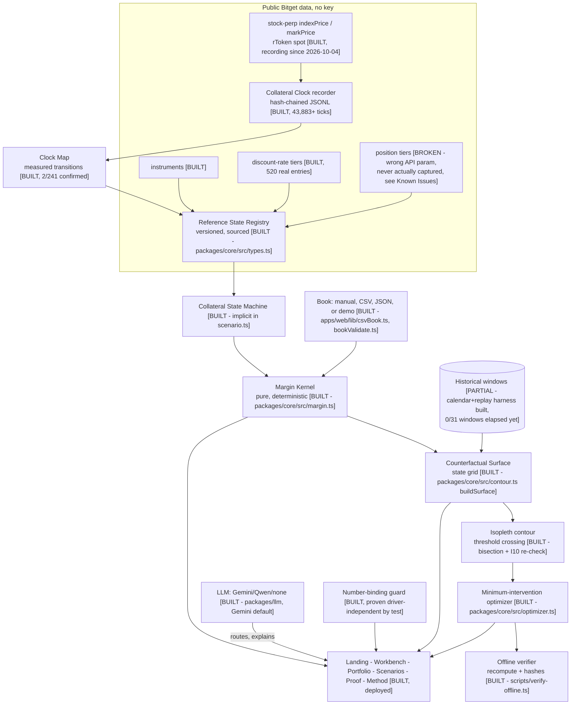

# ARCHITECTURE.md

The system architecture as actually built, as of 2026-10-07. This file was
badly out of date until this revision — it described Phase B/D as entirely
`[PLANNED]` while the product, kernel, and AI layer were already built and
deployed. Status tags below reflect the real state, checked against the
actual files in this repo, not the original build plan's phase order.



## Known issues (stated plainly, not buried)

- **Position-tier capture is broken and was never actually working.**
  `scripts/discovery/e2-rules-extraction.ts` calls
  `/api/v3/market/position-tier` with `productType=USDT-FUTURES`, but the
  endpoint returns `{"code":"400172","msg":"Parameter verification failed"}`
  for every single symbol — the script recorded these error envelopes as if
  they were successful captures, because it never checked `code !== "00000"`
  before writing the file. All 244 "captured" position-tier files in
  `data/clock/rules/position-tier/` are error responses, not real tier data.
  This is why U5/U8 (tier boundary semantics) were still UNKNOWN — there was
  never real ladder data to check them against. **Fix in progress**: the
  correct parameter name needs to be confirmed live (likely `category`
  instead of `productType`, matching every other v3 endpoint in this
  codebase) and the script needs a `code !== "00000"` guard so a failed
  capture can never again be silently treated as a success.
- **Historical window replay (E4) has zero real `G_w` values.** Not a bug —
  no window in `data/windows/window-set.json` has elapsed since the recorder
  started (2026-10-04). The harness (`scripts/discovery/e4-replay.ts`) is
  real and tested; it has nothing to replay yet.
- **A liquid-name freeze+thaw has not been confirmed.** Same root cause:
  time hasn't passed yet. The next clean test window is the 2026-10-09–12
  weekend. The GitHub Actions recorder (`.github/workflows/recorder.yml`) is
  confirmed live on a 10-minute cron so this does not depend on anyone's
  laptop staying on.

## Monorepo layout — actual state

```text
isopleth/
  DISCOVERY.md PROGRESS.md CLAIMS.json EVIDENCE_MANIFEST.md PROOF.md         [BUILT]
  METHOD.md LIMITATIONS.md ARCHITECTURE.md MILESTONE.md SUBMISSION.md       [BUILT]
  README.md                                                                 [BUILT]
  TASK.md, FINAL_INSTRUCTION.md -> moved to reference/ (gitignored)         [intentionally not public]
  docs/
    sources/        [PARTIAL - NYSE calendar fetched live; Bitget support articles not re-fetched]
    screens/        [BUILT - 5 uniform landscape screenshots, scripts/capture-screenshots.ts]
    lighthouse/     [BUILT - 97-99 perf, 100 a11y/BP/SEO on all 6 routes]
    mcp-tools.json  [BUILT - 19 bitget-signal tools, live-confirmed]
  packages/
    core/      [BUILT - types, margin kernel, scenario operators, contour, optimizer, hash, e4stat]
    data/      [PARTIAL - client.ts, tick.ts, guards.ts, chainVerify.ts built; position-tier capture broken, see above]
    llm/       [BUILT - gemini/qwen/none drivers, bind.ts guard, toolLoop.ts, bitget-signal.ts client]
  apps/web/    [BUILT - Next.js 15 App Router, 6 routes + 2 API routes, deployed]
  .github/workflows/
    recorder.yml   [BUILT, pushed, confirmed firing on a 10-minute cron]
  data/
    clock/     [BUILT - raw/ (43,883+ ticks), rules/ (discount-rate real, position-tier broken), pairs.json, clock-map.json]
    windows/   [PARTIAL - window-set.json + pre-registration.md + replay-results.json (0/31 elapsed)]
    bench/     [BUILT - scripts/bench.ts, synthetic 36-account grid]
    break/     [BUILT - 8/13 verified, 0 failed, 5 honestly not-yet-built]
    manifests/ [BUILT - scripts/manifest.ts]
    verify/    [BUILT - golden.json fixtures for scripts/verify-offline.ts]
    mcp-cache/ [BUILT - disk-cached bitget-signal responses for offline replay]
  public/img/  [removed from root - copied into apps/web/public/img/, the location Next actually serves from]
  scripts/
    discovery/ [BUILT - e1-e6 probes, e4-replay]
    break.ts manifest.ts bench.ts verify-offline.ts secret-scan.ts         [BUILT]
    capture-screenshots.ts                                                [BUILT]
    build/sync-web-data.ts                                                [BUILT]
  tests/       [BUILT - unit/, property/, 21 tests passing]
```

## Stack — actual state

| Layer | Actual |
|---|---|
| Language | **[BUILT]** TypeScript strict, `noUncheckedIndexedAccess`, `exactOptionalPropertyTypes` |
| Package manager | **[BUILT]** pnpm workspace (`packages/*`, `apps/*`) |
| Validation | **[PARTIAL]** Zod installed; used at the CSV/JSON book-input boundary (`apps/web/lib/bookValidate.ts`), not yet everywhere a boundary exists |
| Testing | **[BUILT]** Vitest + fast-check, 21 tests; Playwright (Chromium only) for QA, 45/45 passing |
| Web | **[BUILT]** Next.js 15 App Router, 6 routes + 2 dynamic API routes, deployed on Vercel |
| Rendering | **[BUILT]** hand-built SVG heatmap + contour, d3-scale/d3-shape |
| Animation | **[BUILT]** one orchestrated contour draw-in on mount, respects `prefers-reduced-motion` |
| Images | **[PARTIAL]** Next's built-in image optimizer used for the 3 staged hero images; no custom `sharp` pipeline |
| AI | **[BUILT]** provider-agnostic (`packages/llm`), Gemini default, number-binding guard proven driver-independent |

## Deployment

Vercel, project `isopleth` under team `kinnoskis-projects`. The one setting
that cannot be expressed in `apps/web/vercel.json` for this CLI-deploy setup
is the project's **Root Directory = `apps/web`** (a dashboard-only field) -
required for Vercel's zero-config Next.js detection to find `apps/web`'s own
`package.json` rather than the monorepo root's. Live: https://isopleth-blue.vercel.app
