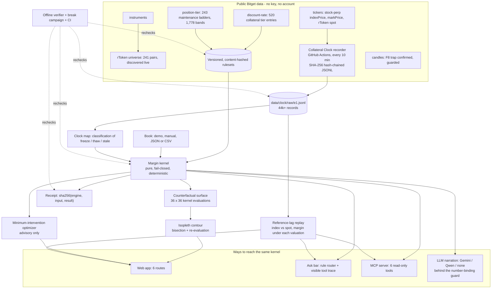

# ARCHITECTURE.md

How Isopleth is built, why it is built that way, and what each part is allowed to claim. Current as of 2026-10-08. Every status below was checked against the files in this repository.

## 1. What it is, in one paragraph

Isopleth answers one question for a Bitget cross-asset account: **how far is this book from the margin boundary, in every direction that matters, and what is the smallest move that keeps it inside?** A margin ratio is one number at one moment. The boundary it sits next to depends on collateral tiers, maintenance tiers, crypto marks and a reference-price clock that freezes and thaws. Isopleth records that clock from public Bitget data, evaluates the book with a deterministic kernel across the state space, locates the threshold contour by bisection, searches for the cheapest action that restores safety, and lets an LLM *explain* the result without ever being able to change a number.

## 2. Design rules that shape everything

| Rule | Meaning | Where it is enforced |
|---|---|---|
| **Fail closed (I5)** | A missing reference price, unknown reference state, empty tier ladder, no covering position tier, or non-positive equity returns a *Refusal with a reason*. Never a plausible substitute. | `packages/core/src/margin.ts`; break attacks B1, B2; `tests/unit/margin.test.ts` |
| **Deterministic (I4)** | Same inputs, same ruleset, same engine version produce byte-identical output. No I/O, no randomness, no clock reads in the kernel. | `packages/core`; golden fixtures in `data/verify/golden.json`; `pnpm verify:offline` |
| **Monotone (I9)** | A strictly worsening mark shock never improves the cross margin rate. | `tests/property/margin.property.test.ts` (fast-check) |
| **Contour is computed, not drawn (I10)** | Contour points come from bisection on the kernel itself, and each located point is re-evaluated and must satisfy the threshold within tolerance. Where no crossing exists the contour has a *gap*, never a bridge. | `packages/core/src/contour.ts`; `ContourChart.tsx`; MCP tool re-checks every point |
| **The model never computes (I6)** | An LLM may explain a result. Any number in its text that the kernel did not produce is rejected and a template is served. | `packages/llm/src/bind.ts`; B6, B7; `tests/unit/number-binding.test.ts` |
| **Read-only (I7)** | Nothing in the system can place an order or move funds. A key with any permission other than read is refused at boot, and unknown permission strings fail closed. | `packages/data/src/guards.ts` `assertReadOnlyKey`; B11; MCP tool names are checked by test |
| **Evidence is labelled** | Every result carries an `evidence` class: `SYNTHETIC` (invented book), `REPLAYED` (real recorded prices), `MEASURED` (observed from the exchange). Nothing is presented as more certain than its class. | `MarginResult.evidence`; UI chips; `/method` |
| **Unknown stays unknown** | Open questions are `UNKNOWN` in a public ledger, not rounded up. | `CLAIMS.json`, `/proof` |
| **Known API traps are guarded in code** | The F8 trap (rToken candle `type=index/mark/premium` silently returns `type=market`) is enforced by a guard so no future code path can be fooled by it. | `packages/data/src/guards.ts`; B12; `pnpm verify:offline` |

## 3. System map



## 4. The layers

### 4.1 Data and the Collateral Clock (`packages/data`, `scripts/discovery`, `.github/workflows/recorder.yml`)

* `client.ts`: public Bitget UTA v3 GET only, with timeout and retry, returns the parsed envelope even on a non-2xx so callers record what Bitget actually said.
* `tick.ts`: one tick per pair per run, recording index price, mark price and rToken spot, then chaining `hash = sha256(prevHash + canonicalJson(record))` onto `data/clock/raw/e1.jsonl`. `buildTickRecord` is pure and **throws `SchemaDriftError`** on a missing row, renamed field or non-numeric price (break attack B10), so schema drift produces a logged error, not a chained null.
* The recorder runs as a GitHub Actions cron every ten minutes and commits as the repository owner, so measurement does not depend on anyone's laptop staying on.
* `chainVerify.ts`: recomputes the whole chain. One edited byte anywhere is caught (B8).
* `guards.ts`: the F8 candle guard and the read-only key guard.
* E2 rules capture (`e2-rules-extraction.ts`): 520 discount-rate entries and 243 maintenance ladders. It requires `code === "00000"` before writing anything (an earlier version stored error envelopes as successes; see `LIMITATIONS.md`).

### 4.2 The margin kernel (`packages/core/src/margin.ts`)

For each collateral asset the effective value is the sum over its tiers of `(value in tier) x tier rate`, where `value = qty x referenceUsd`. For each position the maintenance tier is the one covering its notional (`lo < notional <= hi`), and maintenance margin is `qty x (maintenanceMarginRate + takerFee) x mark`. Long and short sides are netted by taking the larger. Then:

```
adjEquity          = effective collateral + cash + unrealised PnL - liabilities
crossMarginRate    = (maintenanceMargin + partialLiquidationFee) / adjEquity
```

It refuses on: missing reference price, `UNKNOWN` reference state, empty collateral tiers, no covering position tier, non-finite input, non-positive equity. The `(lo, hi]` boundary convention and whether tiers apply marginally or on the aggregate are **assumptions** (claim C6, `UNKNOWN`): the 243 captured ladders prove the bands are contiguous but cannot say how adjacent bands treat the shared boundary value.

### 4.3 Scenarios, surface, contour, optimizer

* `scenario.ts`: one pure operator, `applyScenario`, covering reference shock, collateral-rate override, mark shock and forced reference state. A mark shock moves both maintenance margin *and* unrealised PnL; omitting the second made a crashing book look safer, which is the exact bug this operator prevents.
* `contour.ts`: `buildSurface` evaluates the kernel over a grid; `locateContour` finds the threshold crossing per column by bisection and `verifyContourPoint` re-evaluates it (I10).
* `optimizer.ts`: grid search over add-cash, reduce-position, convert-collateral-to-cash and (if none single suffices) pairs. Returns the three cheapest plans with full traces. Advisory only.

### 4.4 Receipts (`packages/core/src/hash.ts`)

`resultHash(input, result) = sha256(canonicalJson({engineVersion, input, result}))`. Every kernel answer from the API, the Ask bar and the MCP server carries one. `isopleth_verify_receipt` recomputes it from the original input; a one-dollar edit to the result stops it verifying.

### 4.5 Reference-lag replay (`scripts/build/build-replay.ts`, `ClockReplay.tsx`)

Builds `clock-replay.json` from the real chain at build time. For each of 240 pairs it measures how often the public index was unchanged from the previous tick, the longest frozen run (from real timestamps), and the gap to spot. It then evaluates one fixed `SYNTHETIC` book at every tick with collateral valued at the index and at spot; the difference is the exposure from reference lag. A pair whose spot/index gap exceeds 50% is reported as a unit-mapping anomaly and excluded from ranking. It claims nothing about how Bitget's private engine values collateral (C5).

### 4.6 The LLM layer (`packages/llm`)

* Three interchangeable drivers behind one interface: `gemini`, `qwen`, `none`, selected by `LLM_PROVIDER`. `none` is the deterministic path and the product is fully functional with it.
* `toolLoop.ts`: the model is given no numbers up front and must call read-only tools one at a time (`get_current_margin`, `get_stressed_margin`, `get_intervention_plan`, `get_user_thesis`), bounded at seven steps, with earlier results carried forward each turn.
* `bind.ts`: extracts every number from the narration and rejects the whole narration if any is not within tolerance of a kernel fact (also as a percentage). On rejection, a deterministic template is served and the response says so.
* The Gemini driver retries transient 429/503 responses; on any driver error the route serves the verified template and records the error in the response.

### 4.7 The tool surface (`apps/web/lib/mcpTools.ts`, `app/mcp/route.ts`, `lib/ask.ts`)

Six read-only tools: evaluate a book, minimum intervention, locate contour, clock status, reference lag, verify receipt. They are exposed three ways: as an **MCP server** (Streamable HTTP, JSON-RPC 2.0, refuses unknown tools), through the **Ask bar** on `/workbench`, and as the same functions the tests call. The Ask bar routes intent by explicit rules (boundary, what-if with a parsed percent, smallest move, clock) and builds its answer text from the tools' outputs, labelled `NARRATION: TEMPLATE`. Because no model writes that text, it cannot contain an invented number; the trace beneath it shows every call's raw input and output.

### 4.8 The web app (`apps/web`, Next.js 15 App Router)

| Route | Job |
|---|---|
| `/` | The claim, live clock strip, one interactive contour, proof numbers |
| `/workbench` | Current vs stressed book, Ask bar, counterfactual surface with the reopening-gap slider, minimum-intervention plan, "Your book" (paste JSON, upload JSON/CSV) with thesis, AI explain, risk-plan and calendar export |
| `/portfolio` | The live rToken universe with logos |
| `/scenarios` | Four named transitions through the kernel, then the **Clock replay** with the Reference lag atlas |
| `/proof` | The claims ledger, rendered live from `CLAIMS.json`, with reproduce commands |
| `/method` | Measured vs modelled vs unknown |

API: `/api/evaluate` (kernel with receipt), `/api/narrate` (guarded LLM), `/api/ask`, `/api/demo-book`, `/mcp`.

## 5. Evidence and verification

| Mechanism | What it proves | Command |
|---|---|---|
| Unit and property tests | Kernel behaviour, monotonicity, contour, number binding, tool loop, MCP tools, Ask router (27 tests) | `pnpm test` |
| Offline verifier | Golden kernel recompute; clock chain intact; manifested files unchanged; guard behaviour; **243 ladders contiguous and monotone**; **receipt round trip and tamper detection** (7 checks, no network, no model) | `pnpm verify:offline` |
| Break campaign | 12 of 13 attacks (B1-B12) verified; B13 needs elapsed windows | `pnpm break` |
| Benchmark | Synthetic account grid vs random and proportional controls | `pnpm bench` |
| Manifest | Git commit, SHA-256 of every result file, lockfile hash, engine version | `pnpm manifest` |
| CI | typecheck, tests, secret scan, offline verifier, break campaign on every push | `.github/workflows/ci.yml` |
| Browser QA | Playwright (Chromium) layout and axe checks over all routes and device profiles | `apps/web/tests/layout.spec.ts` |

## 6. Repository layout

```text
packages/core     types, kernel, scenario operators, contour, optimizer, hash, null-control statistics
packages/data     public client, tick builder, chain verifier, guards
packages/llm      gemini / qwen / none drivers, tool loop, number-binding guard, bitget-signal client
apps/web          Next.js app, API routes, MCP route, components, lib (ask router, tool surface, book validation)
scripts           discovery probes (E1-E6), break, bench, manifest, verify-offline, secret scan, build steps
data              clock/ (raw chain, pairs, rules), windows/, bench/, break/, manifests/, verify/, mcp-cache/
tests             unit/ and property/
.github/workflows recorder.yml (clock), ci.yml (verification)
```

## 7. Deployment

Vercel project `isopleth`; Root Directory `apps/web` (a dashboard-only setting), `apps/web/vercel.json` pins framework and output directory. The build runs `sync-web-data` (summary numbers from the repository's own data), `build-replay` (the reference-lag replay), then `next build`. Environment: `LLM_PROVIDER`, `GEMINI_API_KEY`, optional `QWEN_*`; none are needed for the product to work.

## 8. What is not built or not known (stated plainly)

* **A confirmed freeze and thaw in a liquid name (C4).** Two thin-liquidity pairs are confirmed; the first clean test for liquid names is the 2026-10-09 to 12 weekend close.
* **Whether markPrice clamps to the frozen index (C5).** Indications only.
* **How tiers apply at boundaries and across bands (C6).** The ladders are captured; the application rule is not published in them.
* **The pre-registered reopening-gap predictor (C7) and the B13 null control.** The permutation harness is built and tested; it needs two fully elapsed closed-market windows.
* **A live Qwen call.** The wire is built; no key has been available. Gemini is the live provider, on a free-tier quota, and the verified template is served when it is exhausted.
* **How Bitget's private engine values collateral.** Needs an optional read-only key probe (E5); the replay therefore shows both valuations.

## 9. Decisions worth knowing about

* **Rules for the Ask bar, a model for narration only.** Routing a risk question with a model adds a way to be wrong and costs quota; rules plus a visible trace are cheaper, always available and auditable. The model is kept where it adds value (plain-language explanation) and is fenced by the guard.
* **Bisection instead of interpolation.** A contour interpolated from rendered pixels can pass through a region the kernel would refuse. Bisection on the kernel cannot.
* **Hash-chained JSONL instead of a database.** The recording is the evidence; an append-only file that a stranger can verify with a short script is stronger than a table that has to be trusted.
* **Both valuations in the replay.** Choosing one would assert C5. Showing both keeps the claim honest.
* **Anomalies are reported, not hidden.** BYDUSDT's 612% gap is shown as an anomaly with its cause class (unit mapping) instead of being silently dropped or ranked as lag.
