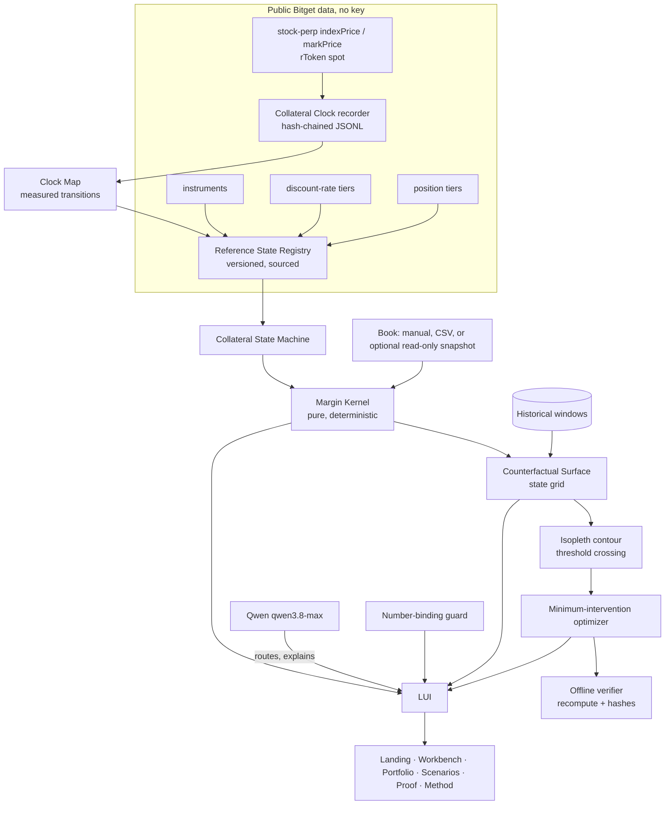

# ISOPLETH: Final Master Build Instruction

Single source of direction. Read fully before writing any code.

Project folder: `C:\dev\isopleth` (Windows, Cursor, PowerShell). WSL only for bash-only tools.

Hackathon: Bitget AI Base Camp Hackathon S2. Submission deadline Oct 8 (extended from Sep 27, confirmed by @Bitget_AI on X). Track: **AI Trading Desk**. Sub-theme: **Decision Stress Testing**.

---

## 0. The verdict on Isopleth, and what changed

**Keep the name ISOPLETH. Keep its product surface. Restore the measured spine it was missing.**

ChatGPT's Isopleth is a better *product* than Verglas and a weaker *entry*. Here is the precise reason, and it is the only architectural decision in this file that matters:

Isopleth as written computes a counterfactual margin surface from synthetic books plus published Bitget formulas. Nothing in it measures anything. Its own discovery section says "verify, do not assume", but every verification it lists is reading a document. A judge who opens the proof page asks one question: *what did you find that I could not have read in the docs?* An engine built only from documented formulas has no answer. That is exactly the VEIL failure: broad, polished, no load-bearing insight.

Verglas had the opposite problem: a real measurable discovery, wrapped in a thinner product.

The correct build is not a compromise between them. It is this:

> **A risk surface needs axes. Isopleth's reference-price axis is measured, not assumed. Everything else follows.**

So: the Counterfactual Collateral Surface stays, the contour stays, the optimizer stays, the evidence reversibility stays. The reference-state axis stops being a dial the user drags through imaginary states, and becomes a **state machine driven by a clock we recorded ourselves**.

What ChatGPT got right, and is kept verbatim in this file:
- read-only private account is an optional verification adapter, never a prerequisite;
- the Counterfactual Collateral Surface and the Isopleth contour as the signature visual;
- the minimum-intervention optimizer;
- evidence reversibility (Decision -> Result -> Scenario -> Engine inputs -> Source);
- zero funds, zero holdings, zero paid infrastructure;
- do not claim exact Bitget reproduction until verified; downgrade to "modelled margin state" otherwise.

What it got wrong, and is corrected here:
- it dropped the measurement entirely. Restored as E1, below, and it is the headline.
- it treated "the freeze is documented, therefore it is not a discovery" as disqualifying. Documented is not measured. Canon won HydraDB with a problem everyone already knew about (superseded documents in RAG) because it *measured* it (14/20 -> 1/20). The freeze being documented is what makes measuring it credible, not what makes it worthless.
- it was right that `indexPrice == rToken collateral index` is unproven. This file never assumes it. See 2.2: the claim is built so it survives either outcome.

---

## 1. Thesis

### 1.1 Five lines

```text
NAME:      ISOPLETH
PROBLEM:   A Bitget cross-asset trader reads one margin number. That number is a snapshot of
           one state. The boundary it sits near moves when the state changes, and the trader
           cannot see the boundary.
DISCOVERY: One axis of that state, the rToken reference price, does not move continuously.
           It freezes on a schedule nobody has published precisely and thaws in one step.
           We measure that clock from public data and make it an explicit engine input.
THESIS:    Because margin safety is a surface over state, not a number, we can map the contour
           where a book crosses from safe to fragile, for traders holding rTokens as UTA margin.
PROOF:     [script-generated] measured freeze and thaw instants, reproduction error of the
           modelled margin state, contour movement vs a null control, replay over real windows.
```

### 1.2 Primary pitch

> **Your margin ratio is a snapshot. Isopleth maps the boundary it is sitting next to, and shows you the smallest move that keeps you inside it.**

### 1.3 The falsifiable architectural claim

> **Margin safety is a surface over state, not a number. The AI explains the surface. Deterministic code computes it. The trader decides.**

Every component proves this from a different angle:

| Component | Angle |
|---|---|
| Collateral Clock (E1) | The reference-state axis is measured from public data, not assumed |
| Reference State Registry | Every state used in a calculation is versioned and sourced |
| Margin kernel | Pure deterministic function, state in, margin result out |
| Counterfactual surface | The same kernel evaluated across a state grid |
| Isopleth contour | The threshold crossing, located exactly, not eyeballed |
| Minimum-intervention optimizer | The surface is actionable, not decorative |
| Offline verifier | Recomputes every published result with no network and no model |
| Null control | The contour moves because of the mechanism, not because of plotting noise |
| Qwen layer | Explains and routes. Cannot produce a number (I6) |

### 1.4 Why the name

An isopleth is a line on a map joining points of equal value. Our contour joins the points where a book has equal risk, and in particular the line where it crosses out of safety. Technical, professional, memorable, and directly tied to the mechanism rather than decorating it.

Run a GitHub, npm, domain and X collision check before repo lock. Record the result in `DISCOVERY.md`. If a collision appears, stop and ask.

### 1.5 Target user

- **Who:** semi-professional cross-asset traders and small desks who hold rTokens (125+ eligible, up to 95% collateral ratio, tiered) as UTA Advanced Mode margin behind leveraged crypto positions.
- **Today:** they read one margin ratio on one screen and mentally guess at what the next state change does to it.
- **With Isopleth:** they load a book, map the boundary, see which state change breaks it first, and get the smallest intervention that restores the threshold.
- **Why they return:** state changes recur. Every weekend, every US holiday, every tier crossing, every collateral-ratio announcement.
- **Revenue:** per-seat pro tier, API for desks, embeddable margin-safety widget for venues carrying tokenized equity collateral.

### 1.6 The 20-second judge formula

- 0 to 5s: "Your margin number is one point on a moving surface."
- 5 to 10s: "Isopleth maps where the surface crosses into danger."
- 10 to 15s: numbers, generated from `data/bench/results.json`.
- 15 to 20s: "Qwen explains it. A deterministic kernel computes it. An offline verifier rechecks it."

---

## 2. Track fit and the discovery

### 2.1 Why this sub-theme, exactly

Handbook, Decision Stress Testing: *"Before opening a position, how does AI retrieve historically similar scenarios? Input trade idea, retrieve historical distribution, preset stress tests."*

Isopleth hits every clause literally: input is a book plus an optional proposed change; retrieval is real historical closed-market windows; output is a distribution and a contour; presets are named state transitions. Judging is pure judge scoring on feature depth, research quality, LUI fluency and personalized thesis, which rewards exactly this.

Do not drift into Agentic Trading (the LLM must be the decision-maker there, and 50% of the score is paper trading performance) or Alpha Factory (pure quantitative scoring on Sharpe and drawdown). Isopleth is a research instrument. The product never places an order.

### 2.2 The discovery, stated so it survives either outcome

The thing to measure: **the rToken reference-price axis does not move continuously, and the exact transition instants are not published.**

There are two observable surfaces for it, and we record both:

1. **Public stock-perp `indexPrice`** (futures ticker, no account, no key). Freezes and thaws on the stock-market schedule.
2. **Private per-coin valuation** inside a UTA account, which is what actually drives collateral value (optional, free via Demo Trading, see 6.2).

**Never claim these are the same thing without evidence.** State what is measured:

- If E1 shows `indexPrice` freezes and thaws: the claim is *"the public reference feed for stock instruments freezes from X to Y, measured"*. That is true and useful regardless of whether it is byte-identical to the internal collateral index.
- If the optional private adapter later confirms the private valuation moves at the same instants: upgrade the claim to a measured correspondence, with the error stated.
- If they diverge: **that divergence is a better finding than agreement**, and it becomes the headline. Publish it.

All three outcomes produce a publishable, honest result. That is why this is the right spine.

---

## 3. Documented facts and the UNKNOWN register

Re-fetch every source in Phase A and store the fetched text in `docs/sources/` with the date.

### 3.1 Documented

| ID | Fact | Source |
|---|---|---|
| F1 | Stock-token margin value = index price x collateral ratio. On weekends and US holidays the index is fixed at the last trading day's extended-session close, resuming after reopening. | bitget.com/support/articles/12560603884928 |
| F2 | "Frozen prices over the weekend do not mean frozen risk." Risk is computed in real time; a Monday gap can liquidate before margin can be added. | same |
| F3 | Cross margin rate = (maintenance margin + partial liquidation fees) / adjusted equity. Warning at 80%+. Above 100% begins pre-partial liquidation. Partial liquidation has 3 stages; stage 2 converts high-collateral-ratio assets into liability assets. | bitget.com/support/articles/12560603839176 |
| F4 | Adjusted equity = sum of qty x USD price x collateral ratio, tiered by amount. Maintenance margin = position size x (mmr + taker fee) x mark x quote USD, max of long and short side. | same |
| F5 | Collateral ratios up to 95%, tiered downward as amount grows, varying by asset, changed by announcement. 125+ rTokens in the UTA pool since July 2026. | bitget.com/support/articles/12560603889318 |
| F6 | Public endpoints: `/api/v3/market/discount-rate` (tiered rates per coin), Position Tier, Index Price Components, Cash Dividend Records, Split Records, Liquidations History (3 days only). | bitget.com/api-doc/uta/public/Get-Discount-Rate and siblings |
| F7 | Private `/api/v3/account/assets` (UTA management read) returns `effEquity`, `mmr`, `imr`, `mgnRatio`, `positionMgnRatio`, `leverage`, per-coin `usdValue`. Also `/api/v3/account/settings` and `/api/v3/account/collateral-type`. | bitget.com/api-doc/uta/account/Get-Account, bitget.com/docs/uta/quick-start |
| F8 | rToken candles support only `market` type. Requesting `mark`, `index` or `premium` silently returns `market` with no error. Intervals 1m 5m 15m 1H 4H 1D. Max 90 days per call. | bitget.com/docs/catalog/market/market-data |
| F9 | Futures tickers (public, no key) include `indexPrice` and `markPrice`. rToken spot tickers include `platformTurnover24h`. Reality orderbook and fills require whitelist. | same and reality trading guide |
| F10 | rToken spot keeps trading on weekends for selected assets via platform liquidity while the collateral index is frozen. | bitget.com/academy/how-bitget-maintains-rtoken-liquidity-outside-us-market-hours-2026-guide |
| F11 | UTA is an account mode (vs Classic). Advanced Mode inside UTA is the toggle enabling cross-asset collateral. Both are settings changes, no deposit, and UTA is open to all users with the former asset requirement removed. | bitget.com/support/articles/12560603885783, bitget.com/support/articles/12560603895189 |
| F12 | Bitget Demo Trading is a free virtual-funds environment. Switch to Demo mode, create a Demo API Key under API Key Management, send header `paptrading: 1`. No deposit. | bitget.com/api-doc/classic/demotrading/restapi |
| F13 | Agent Hub SDK: `loadConfig({ readOnly: true })`, `buildTools`, `safeInvoke`, `discover`, `MockServer`. `bitget-mcp-server` HTTP MCP at `https://agent.bitget.com/mcp` for US equity quotes, history, fundamentals, analyst data. `bitget-signal` provides 5 research skills, no account needed. | bitget.com/docs/uta/agent-hub |
| F14 | Generic Place Order does not support Reality symbols. (We never order. Note only.) | reality trading guide |

### 3.2 UNKNOWN register

| ID | UNKNOWN | Resolved by |
|---|---|---|
| U1 | Exact instant the public stock-perp `indexPrice` freezes and thaws, in ET. | E1 |
| U2 | Whether it is live, stale or frozen during the weekday overnight session (20:00 to 04:00 ET). | E1 |
| U3 | Whether private per-coin `usdValue / equity` tracks `indexPrice` at the same instants. | E5, optional |
| U4 | Whether `mgnRatio` equals `(mmr + fees) / effEquity`, and the kernel's error against it. | E5, optional |
| U5 | Whether collateral tiers apply marginally per coin or on aggregated value. | E2 |
| U6 | Whether `markPrice` on stock perps is clamped to the frozen index or floats. | E1 |
| U7 | Whether the weekend rToken spot move predicts the thaw gap better than a null. | E4 |
| U8 | Tier boundary semantics: inclusive or exclusive at the exact boundary value. | E2 |
| U9 | Whether Demo Trading exposes UTA Advanced Mode and rToken collateral settings. | E5, optional |
| U10 | Qwen proxy wire: `/v1/responses` vs `/v1/chat/completions`, tool calling, JSON mode. | E6 |
| U11 | Tool names and schemas of `bitget-mcp-server` and `bitget-signal`. | E6 |

Never fill an UNKNOWN from assumption. Mark it, experiment, record.

---

## 4. Phase A: discovery. Start E1 first, everything else in parallel

### 4.1 Setup

```powershell
# PowerShell, in C:\dev\isopleth
node -v            # 20+ required, 22 LTS preferred
corepack enable
pnpm init
pnpm add -D typescript tsx vitest fast-check @types/node @playwright/test @axe-core/playwright
pnpm add zod d3-scale d3-shape motion
pnpm add @bitget-ai/bitget-agent-sdk @modelcontextprotocol/sdk openai
```

`.env.local` is git-ignored. Ship `.env.example` with names only.

### 4.2 E1: the Collateral Clock (headline, public only, zero account, zero cost)

**Start this before writing anything else.** It records an event stream that only exists in wall-clock time, and the current closed-market window is already in progress. Everything else in Phase A runs in parallel while it collects.

- Discover stock perps: public `GET /api/v3/market/instruments?category=USDT-FUTURES`, filter for stock instruments. Do not hardcode the symbol list.
- Every 60 seconds, for each: public `GET /api/v3/market/tickers?category=USDT-FUTURES&symbol=<SYM>` capturing `indexPrice` and `markPrice`; and the matching rToken spot ticker's `lastPrice`, `bid1Price`, `ask1Price`.
- Record `tsUtc`, `tsEt` (America/New_York), and the raw response bodies.
- Hash-chain every record: `hash = sha256(prevHash + canonicalJson(record))`.

Segmentation script classifies each series into `OPEN_LIVE`, `MARKET_CLOSED_FROZEN`, `REOPENING`, `STALE`, `UNKNOWN` and extracts every transition instant with its ET timestamp. `FROZEN` requires `indexPrice` constant across >= 10 consecutive samples while `markPrice` or rToken spot moves. `STALE` is constant while everything else is also idle. A sampling gap longer than tolerance becomes `UNKNOWN`, never interpolated.

Output `data/clock/clock-map.json`. Pass condition: transitions identified with at least two independent occurrences, or one occurrence clearly labelled N=1.

```ts
// scripts/discovery/e1-collateral-clock.ts
// PUBLIC ONLY. No API key. No account. No cost.
import { appendFile, mkdir, readFile } from "node:fs/promises";
import { createHash } from "node:crypto";
import { setTimeout as sleep } from "node:timers/promises";
import { bitgetPublicGet } from "../../packages/data/src/client";

const OUT = "data/clock/raw/e1.jsonl";

const etFmt = new Intl.DateTimeFormat("en-CA", {
  timeZone: "America/New_York", hour12: false,
  year: "numeric", month: "2-digit", day: "2-digit",
  hour: "2-digit", minute: "2-digit", second: "2-digit",
});

function canonical(o: unknown): string {
  return JSON.stringify(o, (_k, v) =>
    v && typeof v === "object" && !Array.isArray(v)
      ? Object.fromEntries(Object.entries(v as Record<string, unknown>).sort(([a], [b]) => a.localeCompare(b)))
      : v);
}

async function lastHash(): Promise<string> {
  try {
    const lines = (await readFile(OUT, "utf8")).trimEnd().split("\n");
    return JSON.parse(lines[lines.length - 1]!).hash as string;
  } catch { return "GENESIS"; }
}

interface Pair { perp: string; spot: string }

async function tick(pairs: Pair[], prev: string): Promise<string> {
  const t = Date.now();
  for (const { perp, spot } of pairs) {
    const p = await bitgetPublicGet("/api/v3/market/tickers", { category: "USDT-FUTURES", symbol: perp });
    const s = await bitgetPublicGet("/api/v3/market/tickers", { category: "SPOT", symbol: spot });
    const rec = {
      tsUtc: t, tsEt: etFmt.format(new Date(t)), perp, spot,
      indexPrice: Number(p.data?.[0]?.indexPrice ?? NaN),
      markPrice: Number(p.data?.[0]?.markPrice ?? NaN),
      spotLast: Number(s.data?.[0]?.lastPrice ?? NaN),
      raw: { perp: p.data?.[0] ?? null, spot: s.data?.[0] ?? null },
    };
    const hash = createHash("sha256").update(prev + canonical(rec)).digest("hex");
    await appendFile(OUT, JSON.stringify({ ...rec, prevHash: prev, hash }) + "\n");
    prev = hash;
  }
  return prev;
}

await mkdir("data/clock/raw", { recursive: true });
const pairs: Pair[] = JSON.parse(await readFile("data/clock/pairs.json", "utf8")); // produced by E2 instrument scan
let prev = await lastHash();
for (;;) {
  try { prev = await tick(pairs, prev); }
  catch (e) { await appendFile("data/clock/raw/e1-errors.jsonl", JSON.stringify({ t: Date.now(), e: String(e) }) + "\n"); }
  await sleep(60_000);
}
```

Run it locally now, and in parallel ship it as a GitHub Actions scheduled workflow so collection survives your machine sleeping:

```yaml
# .github/workflows/recorder.yml
name: collateral-clock
on:
  schedule: [{ cron: "*/10 * * * *" }]
  workflow_dispatch:
permissions: { contents: write }
concurrency: { group: recorder, cancel-in-progress: false }
jobs:
  tick:
    runs-on: ubuntu-latest
    steps:
      - uses: actions/checkout@v4
      - uses: actions/setup-node@v4
        with: { node-version: 22 }
      - run: corepack enable && pnpm install --frozen-lockfile
      - run: pnpm tsx scripts/discovery/recorder-tick.ts   # single tick, then exit
      - run: |
          git config user.name "isopleth-recorder"
          git config user.email "recorder@users.noreply.github.com"
          git add data/clock
          git diff --staged --quiet || git commit -m "clock: $(date -u +%FT%TZ)"
          git pull --rebase --autostash && git push
```

GitHub's scheduler is best-effort and can be late. The UI must display snapshot age, never claim real-time.

### 4.3 E2: rules extraction (public, no key)

- `instruments` for every category: symbols, `symbolType`, taker fee, quote currency. Write `data/clock/pairs.json` for E1.
- `discount-rate` for every eligible coin: full tier ladder, captured with a version hash so later changes are detected and replayable (B4).
- Position Tier for every stock perp and the crypto perps we model: notional bands, leverage, maintenance margin rate.
- Probe tier boundaries at the exact boundary value to resolve U8 and U5. Record the observed semantics.

### 4.4 E3: silent-fallback trap (F8)

Request rToken candles with `type=index`, diff against `type=market`, confirm identical. Then add a hard guard in `packages/data` so no code path can ever treat rToken `type=index` output as a reference index. This is a real trap other builds will fall into; document it in `CONTRIBUTIONS.md`.

### 4.5 E4: historical windows and the null control

- Build the window set from the NYSE calendar (`data/calendar/nyse-2026.json`, each date verified against the official NYSE holiday page, source URL stored). Include early closes.
- For each closed window since 2026-06-04 (rToken margin launch): rToken 1H candles, stock-perp 1H candles for `index`, `mark` and `market` types, crypto perp 1H candles, underlying daily history via `bitget-mcp-server`.
- Define `G_w` = log(first post-thaw reference print / frozen anchor) per token per window.
- **Pre-register before running, commit the rule to git first:** the shadow predictor (weekend rToken spot move) is published as informative only if leave-one-window-out MAE beats the null (zero) by >= 20% and beats a permuted-shadow control at p < 0.05 over 10,000 permutations. Otherwise drop it and publish the empirical distribution alone. State N. The sample is small; say so.

### 4.6 E5: optional private verification adapter (free, never a prerequisite)

Only if the human supplies credentials. Never blocks any other work.

- Preferred: a Demo Trading key (F12), zero real funds. Alternative: a live read-only key with UTA Trade read-only and UTA Management read-only, no trade, no withdraw, no transfer.
- `pnpm verify:bitget` runs locally, reads `/api/v3/account/assets`, `/api/v3/account/settings`, `/api/v3/account/collateral-type`, strips secrets, and writes `evidence/bitget-snapshot.json`.
- The engine then reproduces `effEquity`, `mmr` and `mgnRatio` from the same inputs and publishes max and median absolute error. Epsilon is set *from* this data, never chosen first.
- **An empty account is still a valid result.** It verifies the extraction and interpretation layer end to end. Never present an empty account as if it held positions.
- If reproduction is not achieved: rename the output `modelled margin state` everywhere and downgrade the claim. Never inflate a model into an official exchange calculation.
- The credential never reaches the browser, Vercel client bundles, or git.

### 4.7 E6: Qwen and MCP probes

- `e6-qwen-probe.ts`: test both wires on `qwen3.8-max`, plus tool calling and strict JSON. Record which works.
- `e6-mcp-tools.ts`: `listTools` against `https://agent.bitget.com/mcp` and the Signal MCP. Write `docs/mcp-tools.json`. Never assume tool names.

### 4.8 Gate A exit criteria

Do not start Phase B until all are true and written into `DISCOVERY.md`:

- [ ] At least one freeze and one thaw transition measured, with ET instants and raw evidence, or the honest N=1 / not-observed result written.
- [ ] Tier ladders and position tiers captured and version-hashed.
- [ ] The silent-fallback trap confirmed and guarded.
- [ ] Window set built with sources.
- [ ] Pre-registered control rule committed.
- [ ] Break plan and proof plan written.

`DISCOVERY.md` fields, per discovery: sponsor primitive; observed constraint; official evidence; source URL; runtime evidence path; what surprised us; why common approaches miss it; user harm; capability unlocked; hard invariant; falsifiable claim; reproducible command; classification (MEASURED / REPLAYED / SYNTHETIC / UNKNOWN).

---

## 5. Architecture



```text
 public data ---> REFERENCE STATE REGISTRY (versioned rules + measured clock)
                              |
 book -------->  COLLATERAL STATE MACHINE  --->  MARGIN KERNEL (pure)
                              |                        |
                              |                 offline verifier
                              v                 recomputes all
                   COUNTERFACTUAL SURFACE
                              |
                     ISOPLETH CONTOUR
                              |
                  MINIMUM-INTERVENTION PLAN
                              |
        Qwen ---> number-binding guard ---> HUMAN DECISION
```

### 5.1 Monorepo

```text
isopleth/
  FINAL_INSTRUCTION.md DISCOVERY.md TASK.md PROGRESS.md CLAIMS.json
  EVIDENCE_MANIFEST.md PROOF.md METHOD.md LIMITATIONS.md CONTRIBUTIONS.md
  ARCHITECTURE.md SUBMISSION.md README.md
  docs/governance/ docs/sources/ docs/screens/ docs/mcp-tools.json
  packages/
    core/      types, state machine, margin kernel, surface, contour, optimizer (zero deps)
    data/      Bitget adapters, signer, parsers, guards
    evidence/  hash chain, manifest, claims, offline verifier
    qwen/      server-side adapter, tool loop, number-binding guard
  apps/web/    Next.js 15 App Router, route handlers double as the API
  .github/workflows/  recorder.yml, verify.yml
  data/        clock/ windows/ rules/ bench/ break/ manifests/ calendar/
  scripts/     discovery/ bench.ts break.ts manifest.ts readme-numbers.ts
  tests/       unit/ property/ e2e/
```

Stack, all free tier: TypeScript strict, pnpm workspace, Vitest + fast-check, Zod at every boundary, Next.js 15 route handlers (no separate API server), React 19, hand-built SVG contour rendering with `d3-scale` and `d3-shape`, `motion` for animation, `sharp` for images. No Render. No paid database. Supabase only if a discovery proves it necessary.

### 5.2 Named invariants, each with an executable checker

| ID | Invariant |
|---|---|
| I1 | Provenance completeness: every material number traces to a source or a labelled synthetic/replay input |
| I2 | State completeness: no margin result without a declared reference state and a rule-set version |
| I3 | Tier correctness: every result records the exact tier selected, by the verified rule |
| I4 | Determinism: same serialized inputs + ruleset + engine version produce an identical output hash |
| I5 | No silent downgrade: stale, missing or malformed input yields an explicit refusal, never a plausible substitute |
| I6 | LLM non-authority: every number in any narration exists in the kernel result set |
| I7 | Read-only: zero write-capable tools at runtime; a key with trade or withdraw permission is refused at boot |
| I8 | Evidence reversibility: every decision traces back to source evidence and serialized inputs |
| I9 | Monotonicity where expected: a strictly worsening shock never improves modelled safety; exceptions are tested and documented |
| I10 | Contour soundness: the located contour point satisfies the threshold within tolerance when re-evaluated by the kernel |

---

## 6. The engine

### 6.1 Types

```ts
// packages/core/src/types.ts
export type EvidenceClass = "MEASURED" | "REPLAYED" | "SYNTHETIC" | "UNKNOWN";
export type ReferenceState = "OPEN_LIVE" | "MARKET_CLOSED_FROZEN" | "REOPENING" | "STALE" | "UNKNOWN";

export interface Tier { startUsd: number; rate: number }

export interface CollateralAsset {
  coin: string;
  qty: number;
  referenceUsd: number | null;
  referenceState: ReferenceState;
  tiers: Tier[];
  rulesetVersion: string;
  evidence: EvidenceClass;
  sourceRefs: string[];
}

export interface PositionTier {
  symbol: string; minNotional: number; maxNotional: number;
  maintenanceMarginRate: number; takerFee: number; sourceRef: string;
}

export interface Position {
  symbol: string; side: "LONG" | "SHORT"; qty: number;
  markUsd: number; kind: "crypto" | "stock"; tiers: PositionTier[];
}

export interface Book {
  collateral: CollateralAsset[];
  positions: Position[];
  cashUsd: number;
  liabilitiesUsd: number;
  unrealisedPnlUsd: number;
  partialLiqFeeUsd: number;          // documented input, default 0, see E5
}

export interface MarginResult {
  adjEquityUsd: number;
  maintenanceMarginUsd: number;
  crossMarginRate: number;           // (mm + fees) / adjEquity
  tierSelections: Record<string, string>;
  referenceStates: Record<string, ReferenceState>;
  rulesetVersions: string[];
  evidence: EvidenceClass;
}

export type Refusal = { ok: false; reason: string; field: string };
export type Computed<T> = { ok: true; value: T };
export type Outcome<T> = Computed<T> | Refusal;
```

### 6.2 Kernel, pure and fail-closed

```ts
// packages/core/src/margin.ts
import type { Book, CollateralAsset, MarginResult, Outcome, Position } from "./types";

export function effectiveCollateral(a: CollateralAsset): Outcome<number> {
  if (a.referenceUsd === null) return { ok: false, reason: "missing reference price", field: a.coin };
  if (!Number.isFinite(a.referenceUsd) || !Number.isFinite(a.qty)) return { ok: false, reason: "non-finite input", field: a.coin };
  if (a.referenceState === "UNKNOWN") return { ok: false, reason: "reference state unknown", field: a.coin };
  if (a.tiers.length === 0) return { ok: false, reason: "no collateral tier data", field: a.coin };

  const value = a.qty * a.referenceUsd;
  const tiers = [...a.tiers].sort((x, y) => x.startUsd - y.startUsd);
  let out = 0;
  for (let i = 0; i < tiers.length; i += 1) {
    const lo = tiers[i]!.startUsd;
    const hi = i + 1 < tiers.length ? tiers[i + 1]!.startUsd : Number.POSITIVE_INFINITY;
    if (value <= lo) break;
    out += (Math.min(value, hi) - lo) * tiers[i]!.rate;
  }
  return { ok: true, value: out };
}

function maintenanceFor(p: Position): Outcome<{ mm: number; tier: string }> {
  const notional = p.qty * p.markUsd;
  const t = p.tiers.find((x) => notional > x.minNotional && notional <= x.maxNotional);
  if (!t) return { ok: false, reason: "no position tier covers notional", field: p.symbol };
  return { ok: true, value: { mm: p.qty * (t.maintenanceMarginRate + t.takerFee) * p.markUsd, tier: `${t.minNotional}-${t.maxNotional}` } };
}

export function evaluate(book: Book): Outcome<MarginResult> {
  let collateral = 0;
  const referenceStates: Record<string, import("./types").ReferenceState> = {};
  for (const a of book.collateral) {
    const c = effectiveCollateral(a);
    if (!c.ok) return c;
    collateral += c.value;
    referenceStates[a.coin] = a.referenceState;
  }

  const tierSelections: Record<string, string> = {};
  let mmLong = 0, mmShort = 0;
  for (const p of book.positions) {
    const m = maintenanceFor(p);
    if (!m.ok) return m;
    tierSelections[p.symbol] = m.value.tier;
    if (p.side === "LONG") mmLong += m.value.mm; else mmShort += m.value.mm;
  }

  const adjEquityUsd = collateral + book.cashUsd + book.unrealisedPnlUsd - book.liabilitiesUsd;
  const maintenanceMarginUsd = Math.max(mmLong, mmShort);
  if (!Number.isFinite(adjEquityUsd)) return { ok: false, reason: "non-finite equity", field: "book" };
  if (adjEquityUsd <= 0) return { ok: false, reason: "non-positive adjusted equity", field: "book" };

  return {
    ok: true,
    value: {
      adjEquityUsd, maintenanceMarginUsd,
      crossMarginRate: (maintenanceMarginUsd + book.partialLiqFeeUsd) / adjEquityUsd,
      tierSelections, referenceStates,
      rulesetVersions: [...new Set(book.collateral.map((a) => a.rulesetVersion))],
      evidence: book.collateral.some((a) => a.evidence === "SYNTHETIC") ? "SYNTHETIC" : "REPLAYED",
    },
  };
}
```

### 6.3 Scenario operators

Six operators, one engine. Not six products.

```ts
// packages/core/src/scenario.ts
export interface Scenario {
  id: string;
  referenceShockPct: Record<string, number>;   // rToken reference move
  collateralRatioOverride: Record<string, number>;
  markShockPct: Record<string, number>;        // crypto and stock perp legs
  forceReferenceState?: ReferenceState;        // e.g. REOPENING
  asOf: string;
}
export function applyScenario(book: Book, s: Scenario): Book { /* pure */ }
```

1. **Reference shock**: the rToken reference moves by x%.
2. **Haircut shock**: the collateral ratio moves through its tier ladder, or to an announced new value.
3. **Position-tier shock**: notional crosses a maintenance tier boundary.
4. **Joint transition**: reference + haircut + crypto mark together.
5. **Reopening**: a `MARKET_CLOSED_FROZEN` reference becomes `REOPENING`, applying the first post-thaw print. This is where the measured clock enters the product.
6. **Historical analog**: replay a real measured window through the same engine.

### 6.4 Surface and contour

Evaluate the kernel over a 2D grid (default axes: reference shock vs crypto mark shock; axes selectable). For each grid row, locate the threshold crossing by bisection on the kernel, not by interpolating the rendered pixels. Re-evaluate each located point and assert it satisfies the threshold within tolerance (I10).

```ts
// packages/core/src/contour.ts
export function locateContour(
  book: Book, axis: (x: number, y: number) => Scenario,
  threshold: number, xs: number[], yRange: [number, number], tol = 1e-4,
): Array<{ x: number; y: number | null }> {
  return xs.map((x) => {
    let [lo, hi] = yRange;
    const rate = (y: number): number | null => {
      const r = evaluate(applyScenario(book, axis(x, y)));
      return r.ok ? r.value.crossMarginRate : null;
    };
    const rLo = rate(lo), rHi = rate(hi);
    if (rLo === null || rHi === null) return { x, y: null };
    if ((rLo - threshold) * (rHi - threshold) > 0) return { x, y: null };  // no crossing on this row
    for (let i = 0; i < 60 && hi - lo > tol; i += 1) {
      const mid = (lo + hi) / 2, rM = rate(mid);
      if (rM === null) return { x, y: null };
      if ((rLo - threshold) * (rM - threshold) <= 0) hi = mid; else lo = mid;
    }
    return { x, y: (lo + hi) / 2 };
  });
}
```

A row with no crossing returns `null` and renders as a gap. Never draw a contour through a region where the kernel refused.

### 6.5 Minimum-intervention optimizer

Deterministic grid search over candidate actions: add cash buffer, reduce a position by x%, reduce leverage, convert x% of an rToken to cash at the documented haircut, or the smallest valid pair of two actions. Objective: minimise intervention cost subject to modelled margin rate <= the configured safety threshold across the chosen scenario set.

Returns the top three plans, each with: current state, scenario state, intervention, residual risk, full calculation trace, source evidence, evidence class. Advisory only. Never executes. Qwen may order the presentation of kernel-approved plans; it may never alter a number.

### 6.6 Property tests (fast-check)

Monotonicity of `effectiveCollateral` in `qty`; tier-boundary continuity; I4 determinism over random books; I5 refusal on NaN, negative equity, missing tier, unknown state; I9 monotonicity under strictly worsening shocks; I10 contour re-evaluation.

---

## 7. Qwen boundary

```ts
// packages/qwen/src/client.ts
import OpenAI from "openai";
export const qwen = new OpenAI({
  apiKey: process.env.QWEN_API_KEY,
  baseURL: process.env.QWEN_BASE_URL ?? "https://hackathon.bitgetops.com/v1",
});
export const MODEL = process.env.QWEN_MODEL ?? "qwen3.8-max";
```

Use whichever wire E6 proved. Do not assume JSON mode or native tool calling; prompt for strict JSON, validate with Zod, retry once, then fall back to a deterministic parser.

Read-only tool surface only: `get_book`, `get_clock`, `get_rules`, `run_scenario`, `locate_contour`, `propose_plan`, `replay_window`, `get_research`. Reject any call outside the list.

```ts
// packages/qwen/src/bind.ts
export function extractNumbers(text: string): number[] {
  return (text.match(/-?\$?\d[\d,]*\.?\d*%?/g) ?? [])
    .map((s) => Number(s.replace(/[$,%]/g, "").replace(/,/g, "")))
    .filter(Number.isFinite);
}
export function bindNumbers(text: string, facts: readonly number[], tol = 0.005):
  { ok: boolean; orphans: number[] } {
  const orphans = extractNumbers(text).filter((n) =>
    !facts.some((f) => Math.abs(f - n) <= Math.max(tol, Math.abs(f) * tol)
                    || Math.abs(f * 100 - n) <= tol));
  return { ok: orphans.length === 0, orphans };
}
```

On failure: discard the narration, serve the deterministic template, log the event, and count it in the break results. The product must work fully with Qwen removed; template narration is labelled `NARRATION: TEMPLATE`.

Research sources, used only where they feed the mechanism: `bitget-mcp-server` for underlying history, earnings calendar and fundamentals (feeds historical analogs and event flags); `bitget-signal` `macro-analyst`, `technical-analysis`, `sentiment-analyst`, `news-briefing`, `market-intel` for scenario context. Cache every response to disk with a timestamp so replay works offline.

---

## 8. Product

Six routes. Each complete. No settings page. No login.

| Route | Job |
|---|---|
| `/` | Landing: the claim, the live clock strip, one interactive contour moment, proof numbers |
| `/workbench` | The desk: book, current state, surface, contour, plan, Ask bar with tool trace |
| `/portfolio` | Book builder and the rToken universe board |
| `/scenarios` | Scenario library and historical analogs |
| `/proof` | Claims ledger, manifest, verifier output, break results, clock map, reproduce commands |
| `/method` | Transparent methodology, what is measured vs modelled |

**Book input:** manual entry, CSV or JSON import, and a Demo book using real current public prices. Optional read-only key mode runs locally only (`pnpm verify:bitget`), never in the browser.

**rToken universe, visible on the dashboard, built from data not hardcoded:** intersect `instruments` (spot, Reality) with coins present in `discount-rate`. Must visibly include rAAPL and rNVDA; expect rMSFT, rGOOGL, rTSLA, rAMZN, rSPY, rQQQ, rTSM, rAVGO. Per tile: reference price, market price, reference state chip, collateral ratio for the tier, last update with age, evidence class, and transition-risk badge. Show `UNKNOWN` as `UNKNOWN`.

**Ask bar (LUI fluency):** preset chips, streaming answer, visible tool trace where each call expands to raw inputs and outputs, structured result cards, template-narration badge when Qwen is off. Examples: "Where does my book break first?", "What if NVDA reopens down 7%?", "What if my BTC position crosses the next tier?", "Replay my book through Labor Day."

**Personalized thesis:** on first use ask one question, "What are you protecting?", keep it in session state, show it above every result, and phrase outputs against it.

**Export:** single-page risk plan (Markdown and print HTML) plus an `.ics` with reminders before each US market closure.

**Copy rules:** sentence case, active voice, buttons name the result ("Map the boundary", "Export risk plan"). Errors state what failed and how to fix it. No em dashes anywhere.

---

## 9. UI direction (feed section 9 to Antigravity)

### 9.1 Brief

A light, magazine-quality research instrument. The subject is a risk surface: scientific cartography rendered with luxury editorial restraint. Apple-level polish, Adobe-level alignment. Never a dark neon trading terminal. Never identical rounded SaaS cards. Never tracked all-caps eyebrows on every heading.

### 9.2 Tokens

```css
:root {
  --vellum:   #ECEFEA;   /* page, cool paper */
  --paper:    #F6F7F3;   /* raised surfaces */
  --ink:      #12222E;   /* deep navy, text */
  --ink-soft: #4A5B66;
  --rule:     #C9D1CE;   /* hairlines */
  --safe:     #3F8F6B;
  --warn:     #D9A441;
  --breach:   #B0302A;
  --contour:  #2F7B92;   /* the isopleth line, primary accent */
  --glow: 0 1px 0 rgba(255,255,255,.75) inset, 0 28px 56px -28px rgba(47,123,146,.28);
  --radius-slab: 2px; --radius-panel: 14px; --radius-chip: 999px;
}
```

Different radii by role so nothing is uniform. Paper grain: 3 to 4 percent SVG `feTurbulence` overlay, fixed, `pointer-events: none`.

### 9.3 Typography, self-hosted

- Display serif: **Erode** (Fontshare), 300 and 500, tracking -0.02em, `clamp(3rem, 7.2vw, 7rem)`, line-height 0.96. Fallback `Instrument Serif` via `next/font/google`.
- UI sans: **Switzer** (Fontshare) 400/500/600. Fallback `Geist`.
- Data: **JetBrains Mono** 400/500, `font-variant-numeric: tabular-nums`. Mono for numbers and tool traces only.
- Body 17px/1.6. Lead paragraphs serif 20px/1.55. Line length under 72 characters.
- Load with `next/font/local` from `apps/web/public/fonts/`. A Playwright test asserts `document.fonts.check`.

### 9.4 The signature visual

The contour is the product's identity and the only place to spend boldness. It must read as a scientific contour map, not a line chart: filled safe region in `--vellum` with a faint grid, fragile region in a soft warm wash, the threshold contour drawn in `--contour` at 2px with a subtle outer glow, the current book position as a precise crosshair marker with its coordinates in mono, scenario points as small ticks, historical analogs as hairline overlays, and gaps left visibly empty where the kernel refused. Axis labels state units and evidence class.

### 9.5 Layout

```text
+-----------------------------------------------------------------------------+
| Isopleth     Workbench  Portfolio  Scenarios  Proof  Method   [Map a book]   |
|                                                                             |
|  Your margin ratio             [ hero image: contour relief,                |
|  is a snapshot.                  right 58%, left 42% clean negative space ]  |
|  The boundary moves.                                                         |
|  Lead paragraph, serif 20/1.55                                               |
|  [Map the boundary]  [See the proof]                                         |
|                                                                             |
|  Clock strip:  rNVDA reference  FROZEN since Fri 16:00 ET · next thaw ...     |
+-----------------------------------------------------------------------------+
| One interactive moment: drag the reopening gap, watch the contour move       |
+-----------------------------------------------------------------------------+
| Historical analogs · Proof numbers (generated) · Who it is for · CTA         |
+-----------------------------------------------------------------------------+
```

Workbench: top strip for book state, margin status, reference state, next transition. Centre for the surface and contour with scenario controls and the threshold marker. Right rail for "What breaks first", "Smallest de-risk action", "Evidence". Bottom for historical analogs, calculation trace and the Qwen brief.

12-column grid, 24px gutters desktop, 16px mobile, max width 1240px. Text at `z-index: 2`, imagery at `z-index: 0`, with a `--vellum` scrim protecting the copy area. Mobile stacks and the image becomes its own band above the headline, never underneath.

### 9.6 Motion (`motion`, respect `prefers-reduced-motion`)

One orchestrated load moment: the contour draws itself once, 1.4s, `[0.22, 1, 0.36, 1]`. The surface morphs when a scenario changes. Numbers count only when they meaningfully change. Evidence drawers slide with restrained easing. No pulsing, no hover-lift on every card, no fade-up on every section.

### 9.7 Antigravity image prompt

Global negative prompt for every image: no text, no logos, no watermarks, no readable UI, no neon, no cartoon or illustration look, no visible faces, no candlestick clutter, no crypto cliches.

| ID | Prompt | Size | Placement |
|---|---|---|---|
| IMG-1 hero | Macro photograph of a precise topographic relief model in pale plaster and cool slate, one ridge line catching cold rim light at blue hour, fine contour striations, shallow depth of field, generous empty negative space across the left 42 percent, palette of glacial navy, pale teal and vellum white, fine film grain, luxury financial magazine art direction | 3200x2000 | Hero right 58%, masked `linear-gradient(90deg, transparent 0 40%, #000 62%)` |
| IMG-2 | Editorial still life of an antique brass surveyor's contour instrument on heavy paper, soft window light, three-quarter angle, negative space right | 2000x2500 | Method page, left column |
| IMG-3 | Macro photograph of a single ruled contour line scored into thick cream paper, raking light revealing the embossed edge, extreme shallow focus | 2400x1600 | Scenario section background, low opacity, never behind text |

Post-process with `sharp`: AVIF and WebP at 640/1280/1920/2560, blurred LQIP, dominant-colour placeholder, `next/image` with `priority` on IMG-1 only, meaningful `alt`.

---

## 10. QA

Playwright projects: iPhone SE, iPhone 14 Pro, Pixel 7, Galaxy S9+, iPad Mini, iPad Pro 11, and 1280x720, 1440x900, 1920x1080, 2560x1440. Chromium for all, WebKit for iPhone where available.

```ts
// tests/e2e/layout.spec.ts
import { test, expect } from "@playwright/test";
import AxeBuilder from "@axe-core/playwright";

const ROUTES = ["/", "/workbench", "/portfolio", "/scenarios", "/proof", "/method"];

for (const route of ROUTES) {
  test(`layout ${route}`, async ({ page }, info) => {
    const errors: string[] = [];
    page.on("console", (m) => { if (m.type() === "error") errors.push(m.text()); });
    await page.goto(route, { waitUntil: "networkidle" });

    const overflow = await page.evaluate(() =>
      document.documentElement.scrollWidth - document.documentElement.clientWidth);
    expect(overflow).toBeLessThanOrEqual(0);

    const collisions = await page.evaluate(() => {
      const safe = [...document.querySelectorAll<HTMLElement>("[data-safe]")];
      const busy = [...document.querySelectorAll<HTMLElement>("[data-busy]")];
      const hits: string[] = [];
      for (const s of safe) for (const b of busy) {
        const a = s.getBoundingClientRect(), c = b.getBoundingClientRect();
        if (Math.min(a.right, c.right) - Math.max(a.left, c.left) > 2 &&
            Math.min(a.bottom, c.bottom) - Math.max(a.top, c.top) > 2)
          hits.push(`${s.className} overlaps ${b.className}`);
      }
      return hits;
    });
    expect(collisions).toEqual([]);

    const fontOk = await page.evaluate(async () => {
      await document.fonts.ready;
      return document.fonts.check("300 48px Erode") || document.fonts.check("48px 'Instrument Serif'");
    });
    expect(fontOk).toBe(true);

    const axe = await new AxeBuilder({ page }).withTags(["wcag2a", "wcag2aa"]).analyze();
    expect(axe.violations).toEqual([]);

    await page.screenshot({ path: `docs/screens/${info.project.name}-${route.replace(/\W/g, "_") || "home"}.png`, fullPage: true });
    expect(errors).toEqual([]);
  });
}
```

Also: CLS < 0.02, LCP < 3s on the hero, visible keyboard focus, a reduced-motion run with no animation, no truncated numbers, 44px minimum tap targets, `/proof` readable at iPhone SE width, a recorder-down test (UI states snapshot age honestly), and a Qwen-off test (template path works). Fix failures at the layout source, never by hiding elements.

---

## 11. Break campaign, benchmark, manifest

`pnpm break` writes `data/break/results.json`. Format: attack, system response, evidence path, verified result.

| ID | Attack | Expected |
|---|---|---|
| B1 | Stale reference snapshot beyond tolerance | Refuse `STALE_INPUT`, no number (I5) |
| B2 | Missing collateral ratio | `UNKNOWN`, never a fabricated value (I5) |
| B3 | Notional exactly on a tier boundary | Deterministic documented behaviour, per E2 (I3, U8) |
| B4 | Collateral ratio ladder changes mid-window | Both rulesets versioned, both replayable, prior plan invalidated with a reason |
| B5 | Position crosses a maintenance tier | Tier changes exactly where the verified rule says |
| B6 | Prompt injection in a research source | Qwen cannot alter calculations or evidence labels (I6) |
| B7 | Qwen emits an invented number | Number-binding guard rejects, template served (I6) |
| B8 | One byte edited in a stored snapshot | Hash mismatch, diverging recompute, fail closed |
| B9 | Duplicate or out-of-order clock record | Dedup and monotonicity logic prevents silent corruption |
| B10 | Public API schema change (simulated) | Adapter fails loudly, never produces plausible wrong values |
| B11 | A key with trade permission supplied | Boot probe refuses it (I7); secret-exposure scan fails the build |
| B12 | rToken candles requested with `type=index` | Guard rejects its use as a reference index (E3) |
| B13 | Null / permuted control | Contour movement vanishes under the null, proving the mechanism produces it, not noise |

`pnpm bench`: baseline is a trader seeing only the current margin number. Intervention is Isopleth's surface, contour and plan. Controls are random top-up and proportional top-up at equal capital. Over a synthetic account grid (leverage x collateral share x position size) replayed across the real window set, measure: threshold crossings detected before the adverse state, share of scenarios where the plan preserves the threshold, false-alarm rate against the null, replay consistency, and reproducibility. Label accounts `SYNTHETIC` and market data `REPLAYED`. State N for both. Include a "what would make this claim false" line.

`pnpm manifest` writes `data/manifests/run_manifest.json`: git commit, SHA-256 of every results file, Node version, lockfile hash, engine version, timestamp.

`pnpm verify:offline` recomputes every published result from stored inputs, with no network and no model, checks every hash, and prints PASS or FAIL per check with counts. CI runs it on every push.

`pnpm readme:numbers` injects generated numbers into README and UI JSON. Never type a number by hand.

`CLAIMS.json`: `{ id, statement, label, evidence_path, reproduce_command, status }`, status `PROVEN` / `PARTIAL` / `UNKNOWN`. `/proof` renders it and supports walking backwards: Decision -> Result -> Scenario -> Engine inputs -> Source evidence.

---

## 12. README structure

1. `# Isopleth` 2. Shields (CI, verify, tests, licence, track, sub-theme) 3. One-line pitch 4. Landing banner screenshot 5. Three-sentence description 6. Product links table (live app, proof page, video, X post, repo docs) 7. 2x2 screenshot grid (Workbench, Contour, Scenarios, Proof) 8. The problem 9. The solution 10. Explore in 2 minutes 11. Mermaid product flow 12. Mermaid architecture 13. ASCII diagram 14. **Feature depth** (sources table, how each feeds the mechanism) 15. **Research quality** (E1 to E6 results, N stated, errors published) 16. **The technical discovery** 17. **Counterfactual margin surface** 18. **LUI fluency** 19. **Personalized thesis** 20. **Bitget integration** 21. **What is measured vs modelled** 22. Validation and benchmarks 23. Break campaign 24. Evidence manifest 25. Honest limitations 26. What is new (all work new, no S1 reuse) 27. Target user and revenue 28. Roadmap 29. Local setup (works from a clean clone) 30. Docs index.

Lead with the user and the problem. Never lead with architecture jargon.

---

## 13. Submission

- **Project Description**, six parts per the handbook: Thesis (highest weight), Target user and product value, Validation data and key metrics (label every figure observed / estimated / targeted), Progress, Deliverables, Your take on AI trading.
- **Role of the LLM**: "Qwen qwen3.8-max parses intent into validated JSON, routes to read-only tools, and narrates kernel results. It never computes a number. A number-binding guard rejects any narration containing a number the kernel did not produce. The product runs fully with Qwen removed." State where Qwen credits were used and whether they sufficed.
- **Track**: AI Trading Desk. **Sub-theme**: Decision Stress Testing.
- **X post** must include `#BitgetHackathon`, `@Bitget_AI`, and quote https://x.com/Bitget_AI/status/2100519318824055159?s=20

Draft:

```text
Your Bitget margin ratio is a snapshot of one state. The boundary it sits next to moves.

Isopleth measures the reference-price clock from public Bitget data, maps the contour where a
cross-asset book crosses from safe to fragile, and names the smallest move that keeps you inside it.

Qwen explains it. A deterministic kernel computes it. An offline verifier rechecks every number.

Break it yourself: <live url>/proof

#BitgetHackathon @Bitget_AI
```

- Video under 3 minutes: 0:00 problem in one sentence; 0:15 the workbench on a real book; 0:45 the contour moving under a scenario; 1:15 the clock map and measured transitions; 1:45 the minimum intervention; 2:05 a break attack rejected; 2:30 Bitget integration; 2:45 what is next. Real app only, no intro slides.

---

## 14. Phases (seed `TASK.md`)

Each phase ends with a Gate Report in `PROGRESS.md`, then waits for `GO`. A Gate Report states: what was verified, what remains UNKNOWN, what changed, what evidence exists, which claims are now allowed, which remain forbidden, whether the next phase is safe.

- **A. Discovery**: repo, governance files, sources fetched, name collision check, E1 recorder running locally and on Actions, E2 to E4 and E6 complete, E5 only if credentials arrive, `DISCOVERY.md`, Gate A exit criteria met.
- **B. Mechanism**: types, reference state registry, collateral state machine, margin kernel, scenario operators, surface, contour, optimizer, deterministic serialization and hashes, unit and property tests, invariants I1 to I5 and I8 to I10.
- **C. Proof**: window set, replay harness, baseline and both controls, bench, break campaign, evidence manifest, claims ledger, offline verifier.
- **D. Product**: landing, workbench, portfolio, scenarios, proof, method. Real data in every view.
- **E. AI**: Next.js route handlers, Qwen adapter on the proven wire, tool loop, Zod schemas, number-binding guard, template fallback, MCP clients with caching, I6 and I7 enforced.
- **F. UI**: fonts, paper, contour rendering, motion, imagery, responsive layouts.
- **G. Attack and QA**: B1 to B13, Playwright matrix, axe, Lighthouse, secret scan, recorder-down and Qwen-off tests, deterministic replay scan.
- **H. Ship**: README with generated numbers, screenshots, video, submission text, X post, clean-clone install test, final claims audit.

**If anything must be cut, cut in this order, from the top:** historical analog overlays on the contour, the `.ics` export, `bitget-signal` integrations beyond one, the scenarios library page (fold presets into the workbench), the method page (fold into proof). **Never cut:** E1, the kernel, the contour, the offline verifier, the break campaign, `/proof`, or the honest limitations section. Those six are the entry.

---

## 15. What you provide

Nothing financial. No holdings, no positions, no deposits, no paid services.

| Item | Why | How |
|---|---|---|
| GitHub repo, public at submission, Actions enabled | Code, free scheduled recorder, CI | Free on public repos |
| Vercel project linked to the repo (Hobby tier) | Frontend | Secrets go in server-only env vars, never client-exposed |
| Qwen credits | LUI and optionally a coding model | Separate Qwen form, KYC (already done), claim from a Telegram admin |
| X account | Required promotional post | Must quote the Bitget post in section 13 |
| Bitget UID, university name if applicable | Form fields | |
| Optional: Fontshare Erode and Switzer into `apps/web/public/fonts/` | Typography | Free for commercial use; fallbacks load if absent |
| Optional: Demo Trading API key, or a live key with UTA read-only permissions | Enables E5 measured verification only | Demo mode toggle, then API Key Management. Never paste into chat, never commit |
| Screen recorder | Video | Any free tool |

The optional key is the only item that touches your account, it is read-only, it runs locally via `pnpm verify:bitget`, and the build ships complete without it.

### Qwen with your coding agent

Codex `config.toml`:

```toml
model = "qwen3.8-max"
model_provider = "bitget-qwen"

[model_providers.bitget-qwen]
name = "Bitget Qwen"
base_url = "https://hackathon.bitgetops.com/v1"
env_key = "BITGET_QWEN_API_KEY"
wire_api = "responses"
```

```powershell
# PowerShell, then fully quit and reopen Codex
setx BITGET_QWEN_API_KEY "paste-your-key-here"
```

Cursor: Settings, Models, paste the key into the OpenAI API key field, enable Override OpenAI Base URL with `https://hackathon.bitgetops.com/v1` (the `/v1` is required), add custom model `qwen3.8-max`. Claude Code is not supported for these credits.

---

## 16. Reference material

**Hackathon**: bitget-ai.gitbook.io/bitgetai_hackathons2 · bitget.com/activity-hub/hackathon · t.me/+vF6Cy5Ud2SM5OTIy · submission form forms.gle/GyWZCMCPocgJdJon6

**Bitget docs**: bitget.com/docs/uta/agent-hub · bitget.com/api-doc/uta/guide · bitget.com/docs/uta/quick-start · bitget.com/api-doc/uta/reality/reality-trading-guide · bitget.com/docs/catalog/market/market-data · bitget.com/api-doc/uta/public/Get-Discount-Rate · bitget.com/api-doc/uta/account/Get-Account · bitget.com/api-doc/classic/demotrading/restapi

**Bitget rules**: support/articles/12560603884928 (stock tokens as margin) · 12560603839176 (collateral ratios and margin maths) · 12560603889318 (cross-asset UTA launch) · 12560603885783 (UTA open to all) · 12560603895189 (cross-asset UTA intro) · 12560603887655 (UTA cross margin supports Reality spot)

**Agent Hub repos**: github.com/Bitget-AI/agent_hub · agent-sdk · agent-mcp · agent-cli · agent-skill · bitget-signal · MCP endpoint https://agent.bitget.com/mcp

**Clone for reading only into `C:\dev\isopleth-refs\` (never fork, never copy code):**

```powershell
mkdir C:\dev\isopleth-refs; cd C:\dev\isopleth-refs
git clone https://github.com/rishu4436/nightshift
git clone https://github.com/mystiquemide/tesrune
git clone https://github.com/Jhaycrypt001/HeyArka
git clone https://github.com/jenzylove/residual
git clone https://github.com/0xNexuz/signal-autopsy
git clone https://github.com/Laegend14/nexus-desk
git clone https://github.com/theeagle2407/Nocturne
git clone https://github.com/Pratiikpy/NightDesk
git clone https://github.com/Enoch208/canon
git clone https://github.com/winsznx/night-shift
git clone https://github.com/acevod/custos
git clone https://github.com/Megacollins/rift24
git clone https://github.com/Modemola/BITGET_HACK
git clone https://github.com/Bitget-AI/agent-sdk
```

Keep all competitor notes in a gitignored `research/` folder. Never in the build repo, code or UI.

### Competitor deltas to hold in view

| Build | Their position | Our delta |
|---|---|---|
| `rishu4436/nightshift` | Closest thesis: frozen rToken collateral vs live crypto. Localhost only, 4 commits, assumes the freeze window without measuring it | We measure the clock, version the rules, verify the kernel, replay real windows, host it, and run a control that could disprove us |
| `mystiquemide/tesrune` | Strongest complete S2 build seen: dark-hours hedging of externally held stock via Bitget perps, real Demo fills, 88 tests, CI. Same track, Open Theme | Its headline action depends on an LLM materiality call its own README says varies between runs. Our headline number is deterministic end to end. It uses Bitget as an execution venue for a position held elsewhere; we model Bitget's own valuation of an asset already on Bitget |
| `Modemola/BITGET_HACK` (Blackout Desk) | Same track **and same sub-theme**, Decision Stress Testing. Direct collision | Differentiate on the measured clock, the contour, and the offline verifier. Read it early in Phase A and record the delta in `research/` |
| `acevod/custos` | rToken structural risk monitor, watches wrapper liquidity | Different axis. Do not build another rToken health monitor |
| `Megacollins/rift24` | Alpha Factory, after-hours information pricing | Different track. Useful for window definitions only |
| `Nocturne`, `NightDesk` | S1 winners, both featured by Bitget on the activity hub. Honest risk tools, reproducible evidence, hard gates | Same honesty standard, plus a measured infrastructure discovery they did not have |
| `Canon` | Baseline / intervention / random control, deterministic rows, run manifest, honest near-miss write-up | Our controls are B13 null and the random and proportional top-up baselines |
| `Night Shift` | One rule, named invariants, fault injection, offline verifier, claims ledger | Same discipline applied to Bitget's margin engine |
| `VEIL` (your S1 loss) | Breadth without one unmistakable sponsor-specific insight | Isopleth must have one mechanism that, if removed, destroys the product thesis |

### The standard

If a judge or another model compares Isopleth against the strongest sample side by side, the deciding lines should be: it cannot exist off Bitget; every number reproduces from a command; it measured something rather than restating the docs; it shows a failure it survived; it states its limits first; and the interface looks commissioned rather than generated.

End of instruction.
