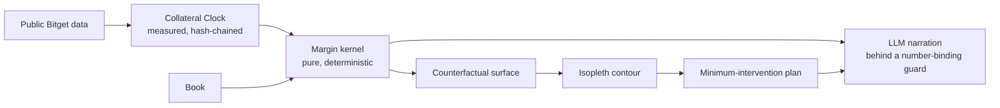

# Isopleth

[]()
[]()
[]()
[]()
[]()
[]()

> Your margin ratio is a snapshot. Isopleth maps the boundary it is sitting next to, and shows you the smallest move that keeps you inside it.

Built for the **Bitget AI Base Camp Hackathon S2** — Track: AI Trading Desk, sub-theme: Decision Stress Testing. Submission deadline: **2026-10-08**.

A Bitget cross-asset trader reads one margin number on one screen. That number is a snapshot of one state. The boundary it sits near moves when the state changes — a weekend close, a tier crossing, a collateral-ratio announcement — and the trader cannot see the boundary move. Isopleth measures one axis of that state directly from public Bitget data (the rToken reference-price clock), computes the rest with a deterministic kernel, and maps the contour where a book crosses from safe to fragile.

**Live app:** deploy pending · **Proof page:** `/proof` · **Repo:** [github.com/0xkinno/isopleth](https://github.com/0xkinno/isopleth)

---

## Explore in 2 minutes

```bash
git clone https://github.com/0xkinno/isopleth.git && cd isopleth
pnpm install
pnpm discovery:e2 && pnpm discovery:e2:rules && pnpm discovery:e3 && pnpm discovery:e4:windows
pnpm discovery:e1          # long-running - the Collateral Clock recorder, leave it going
pnpm discovery:clockmap    # check classification anytime
pnpm run sync:web && pnpm --filter @isopleth/web dev
```

No API key required for any of the above — everything through Phase A/B/C runs on public Bitget data.

## The problem

A margin ratio is a point-in-time number. The surface it sits on moves whenever the underlying state changes, and nothing on a standard exchange UI shows a trader where that boundary currently is, or how close the next state change brings them to it.

## The solution

1. **Measure**, don't assume, the one axis of state that is genuinely undocumented: when the public stock-perp reference price actually freezes and thaws (the Collateral Clock, E1).
2. **Compute** every other axis with a pure, deterministic margin kernel — the same formula Bitget documents (`@isopleth/core`), never an LLM.
3. **Map** the counterfactual surface across a state grid and locate the contour — the exact threshold crossing — by bisection on the kernel itself, never by eyeballing a chart.
4. **Recommend** the minimum-cost intervention that restores the threshold.
5. **Explain**, never compute, with an LLM behind a number-binding guard that rejects any narrated number the kernel didn't produce — and the whole product works with the LLM removed entirely.

## Product flow



## Architecture

See [ARCHITECTURE.md](ARCHITECTURE.md) for the full diagram and monorepo layout, annotated with what's built vs. planned.

```text
isopleth/
  packages/core   margin kernel, scenario operators, contour, optimizer (Phase B - BUILT)
  packages/data   public Bitget client, hash-chained tick log, the F8 guard (BUILT)
  packages/llm    provider-agnostic LLM layer: gemini | qwen | none (BUILT)
  apps/web        Next.js 15, 6 routes, real kernel + real recorded data (BUILT)
  scripts/        discovery (E1-E6), break campaign, manifest (BUILT)
  data/           the evidence itself - clock ticks, tier ladders, windows, break results
```

## Feature depth

| Source | How it feeds the mechanism |
|---|---|
| `/api/v3/market/instruments` (public) | Discovers the rToken-eligible universe live — 241 pairs, no hardcoded list |
| `/api/v3/market/tickers` (public) | Sampled every 60s since 2026-10-04 to build the Collateral Clock |
| `/api/v3/market/discount-rate`, `/api/v3/market/position-tier` (public) | Collateral and maintenance-margin tier ladders, content-hashed |
| `/api/v3/market/candles` (public) | Confirmed the F8 silent-fallback trap live |
| bitget-signal MCP (public, no key) | 19 tools across 5 skills (macro, market-intel, sentiment, technical, news), live-confirmed |
| Gemini / Qwen (one env var) | Narrates kernel results, never computes one |

## Research quality

- **E1** (Collateral Clock): recording since 2026-10-04. As of this writing, 43,401 ticks across 241 pairs. 2 confirmed freeze+thaw transitions in thin-liquidity names (AEHRUSDT, LYTEUSDT); the documented session-wide freeze has **not yet** been confirmed in a liquid name — stated as PARTIAL, not rounded up. Full detail: [DISCOVERY.md](DISCOVERY.md).
- **E2**: instrument scan + tier-ladder capture, both live-confirmed, 84/325 symbols correctly excluded rather than guessed.
- **E3**: F8 trap confirmed live with raw evidence (`data/clock/e3-fallback-trap.json`).
- **E4**: 31 closed-market windows built from the live NYSE 2026 calendar; the null-control rule is pre-registered in writing *before* any replay runs ([pre-registration.md](data/windows/pre-registration.md)).
- **E6**: LLM layer probed for whichever provider is configured — never blocks on Qwen.

## The technical discovery

See [DISCOVERY.md](DISCOVERY.md) for the full writeup, including the name-collision check and the honest N=2-so-far state of the headline measurement.

## Counterfactual margin surface

The `/workbench` route runs a real demo book through `@isopleth/core`'s kernel, locates the contour by bisection, and renders it as SVG — gaps where the kernel refused are drawn as gaps, never bridged.

## LUI fluency

Provider-agnostic LLM layer (`packages/llm`): Gemini today, Qwen via one env var once credits arrive, `none` (deterministic template) as the zero-network fallback. A number-binding guard rejects any narrated number not already in the kernel's output — proven with a test that runs the same book through two different drivers and asserts byte-identical kernel output (`tests/unit/number-binding.test.ts`), and wired live into the product at `/api/narrate`, called from the Workbench's "Explain with AI" button.

## Personalized thesis

The Workbench's "Your book" panel asks "What are you protecting?" — a free-text thesis carried into both the AI narration prompt and the exported risk plan, alongside a manual JSON/file book input that recomputes the real kernel server-side (`/api/evaluate`, validated fail-closed by `apps/web/lib/bookValidate.ts`).

## Bitget integration

Public UTA v3 market data (instruments, tickers, discount-rate, position-tier, candles), the bitget-signal MCP, and optionally a read-only/Demo key (E5, never a prerequisite — not supplied in this build).

## What is measured vs. modelled

See [METHOD.md](METHOD.md). Short version: the rToken universe, tier ladders, and the F8 trap are MEASURED. The margin kernel's output is MODELLED, with an explicit `evidence` field (SYNTHETIC for demo books) on every result. The reference-clock freeze/thaw is still being measured, not yet confirmed.

## Validation and benchmarks

Not yet run (Phase C `pnpm bench` — needs the E4 replay harness, which needs more elapsed windows than exist yet). See [TASK.md](TASK.md).

## Break campaign

`pnpm break` — **7 of 13** attacks verified against the real kernel today (0 failed, 6 honestly marked not-yet-built pending Phase C/E infrastructure they depend on). Full results: [`data/break/results.json`](data/break/results.json).

| ID | Attack | Result |
|---|---|---|
| B1 | Reference state UNKNOWN | PASS — refused |
| B2 | Missing tier data | PASS — refused |
| B3 | Notional exactly on a tier boundary | PASS — deterministic |
| B5 | Position crosses a maintenance tier | PASS |
| B7 | LLM narration contains an invented number | PASS — rejected |
| B9 | Duplicate hash in the real tick log | PASS — zero duplicates across 43,401 records |
| B12 | rToken candle `type=index` misuse | PASS — guard throws |
| B4, B6, B8, B10, B11, B13 | — | Honestly marked NOT_YET, see the results file for why |

## Evidence manifest

[EVIDENCE_MANIFEST.md](EVIDENCE_MANIFEST.md) indexes every artifact. `pnpm manifest` writes `data/manifests/run_manifest.json` (git commit, file hashes, lockfile hash, engine version).

## Honest limitations

Stated first, not buried: [LIMITATIONS.md](LIMITATIONS.md). Leads with "the headline measurement isn't confirmed yet."

## What is new

Everything in this repo was built for this submission. 14 prior-hackathon/competitor repos were cloned read-only into a gitignored `reference/` folder for research only — never copied from, never named in this build's code, UI, or docs ([CONTRIBUTIONS.md](CONTRIBUTIONS.md) documents the one genuinely reusable finding, the F8 trap, for the benefit of anyone else hitting it).

## Target user and revenue

Semi-professional cross-asset traders and small desks holding rTokens as UTA Advanced Mode margin. Revenue: per-seat pro tier, API for desks, embeddable margin-safety widget.

## Roadmap

See [TASK.md](TASK.md) for the full phase-by-phase checklist. Immediate next: confirm a liquid-name freeze+thaw over the 2026-10-09–12 weekend; wire Qwen once credits arrive; build the E4 replay harness.

## Local setup

```bash
pnpm install
pnpm typecheck
pnpm test
pnpm break
pnpm run sync:web && pnpm --filter @isopleth/web dev
```

## Docs index

[FINAL_INSTRUCTION.md](FINAL_INSTRUCTION.md) · [TASK.md](TASK.md) · [MILESTONE.md](MILESTONE.md) · [PROGRESS.md](PROGRESS.md) · [DISCOVERY.md](DISCOVERY.md) · [CLAIMS.json](CLAIMS.json) · [PROOF.md](PROOF.md) · [EVIDENCE_MANIFEST.md](EVIDENCE_MANIFEST.md) · [METHOD.md](METHOD.md) · [LIMITATIONS.md](LIMITATIONS.md) · [ARCHITECTURE.md](ARCHITECTURE.md) · [CONTRIBUTIONS.md](CONTRIBUTIONS.md) · [SUBMISSION.md](SUBMISSION.md)
