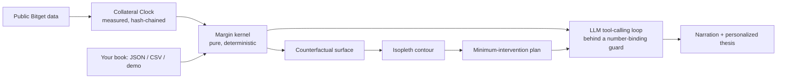
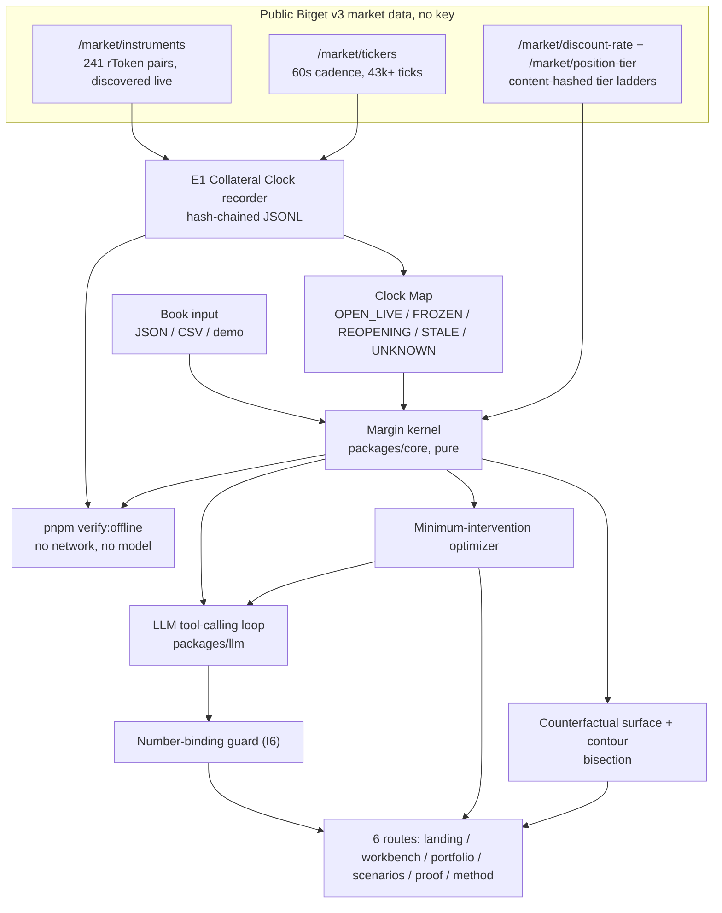
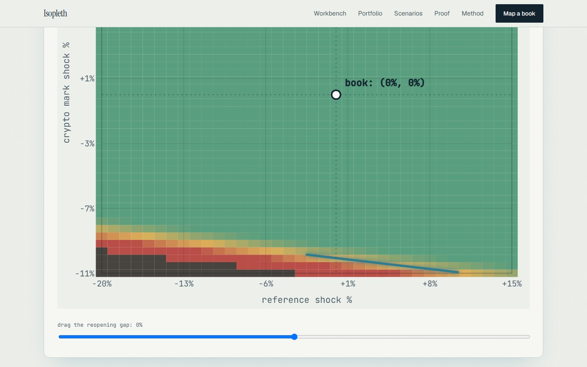
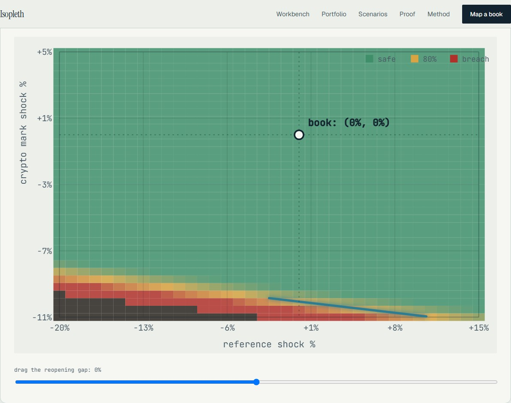
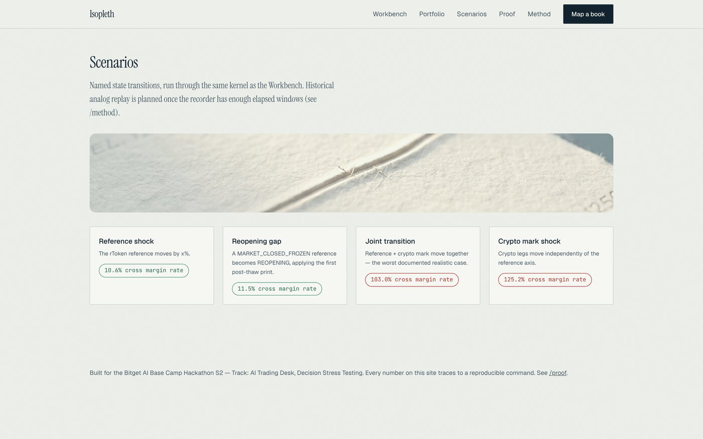
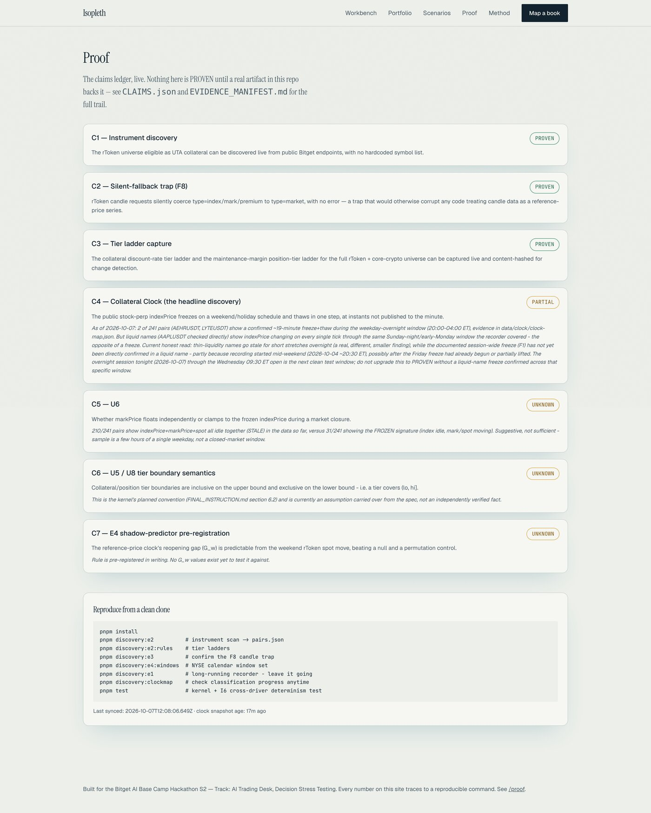

# Isopleth

[]()
[]()
[]()
[]()
[]()
[]()
[]()
[]()

> Your margin ratio is a snapshot. Isopleth maps the boundary it is sitting next to, measures one axis of that boundary directly from public Bitget data, and names the smallest move that keeps you inside it.

<p align="center"></p>

Built for the **Bitget AI Base Camp Hackathon S2** — Track: **AI Trading Desk**, sub-theme: **Decision Stress Testing**. Submission deadline: **2026-10-08**.

A Bitget cross-asset trader holding rTokens as UTA Advanced Mode collateral reads one margin number on one screen. That number is a point-in-time snapshot. The boundary it sits near — set by a collateral tier ladder, a maintenance-margin tier, and a reference-price clock that freezes over weekends and holidays and thaws in one undocumented step — moves whenever the underlying state changes, and nothing on a standard exchange UI shows where that boundary currently is, or how close the next state change brings a trader to it. Isopleth measures the one axis of that state that is genuinely undocumented (the rToken reference-price clock), computes every other axis with a pure deterministic kernel built from Bitget's own documented formulas, and renders the contour — the exact threshold crossing — as a navigable surface, with a minimum-cost plan to stay inside it.

Every number on this site traces to a reproducible command. Nothing is typed by hand; see [`/proof`](#proof) and the reproduce block below.

---

## Product links

| | |
|---|---|
| **Live app** | [isopleth-blue.vercel.app](https://isopleth-blue.vercel.app) — deployed and verified, all 6 routes, zero console errors |
| **Proof page** | [isopleth-blue.vercel.app/proof](https://isopleth-blue.vercel.app/proof) — the claims ledger, walkable Decision → Result → Scenario → Engine inputs → Source evidence |
| **Repository** | [github.com/0xkinno/isopleth](https://github.com/0xkinno/isopleth) |
| **Demo video** | Not yet recorded — see [`SUBMISSION.md`](SUBMISSION.md) for the fixed script and shot list, marked `DO NOT SUBMIT` until filmed |
| **X post** | Draft fixed in [`SUBMISSION.md`](SUBMISSION.md) (`#BitgetHackathon @Bitget_AI`) — not yet posted |
| **Docs index** | [full index below](#docs-index) — 13 cross-referenced documents, every one pulling from the same JSON files the app reads |

---

## Explore in 2 minutes

```bash
git clone https://github.com/0xkinno/isopleth.git && cd isopleth
pnpm install
pnpm discovery:e2 && pnpm discovery:e2:rules && pnpm discovery:e3 && pnpm discovery:e4:windows
pnpm discovery:e1          # long-running - the Collateral Clock recorder, leave it going
pnpm discovery:clockmap    # check classification anytime
pnpm run sync:web && pnpm --filter @isopleth/web dev
```

No API key required for any of the above — everything through Phase A/B/C runs on public Bitget data. Then, to see every other guarantee for yourself:

```bash
pnpm typecheck && pnpm test          # 21/21 unit + property tests, zero network
pnpm verify:offline                   # recomputes every published result from stored inputs - no network, no model
pnpm break                            # the 13-attack break campaign against the real kernel
pnpm bench                            # synthetic account-grid benchmark vs. random/proportional top-up controls
```

---

## The problem

A margin ratio is a point-in-time number. The surface it sits on moves whenever the underlying state changes — a weekend close, a tier crossing, a collateral-ratio announcement — and the trader cannot see the boundary move, only the number after it already has. For a cross-asset book holding rTokens (tokenized equity exposure usable as UTA Advanced Mode collateral), this is worse than for a crypto-only book: the reference price that collateral value depends on **freezes** when the underlying stock market closes and **thaws** in a single undocumented jump when it reopens, and Bitget's own candle API silently feeds back ordinary market data when asked for that reference series directly (confirmed live, see [the technical discovery](#the-technical-discovery)) — a trap that would otherwise corrupt any tool that tried to reconstruct this history from the obvious endpoint.

## The solution

1. **Measure**, don't assume, the one axis of state that is genuinely undocumented: when the public stock-perp reference price actually freezes and thaws (the Collateral Clock, E1) — a hash-chained, tamper-evident recorder running since 2026-10-04, confirmed live and continuing on a 10-minute GitHub Actions cron.
2. **Compute** every other axis with a pure, deterministic margin kernel — the same formula Bitget documents (`@isopleth/core`), never an LLM, fully covered by unit and property tests.
3. **Map** the counterfactual surface across a state grid and locate the contour — the exact threshold crossing — by bisection on the kernel itself, never by eyeballing a chart.
4. **Recommend** the minimum-cost intervention that restores the threshold, via a deterministic grid-search optimizer, benchmarked against blind-allocation controls at equal capital.
5. **Explain**, never compute, with an LLM behind a real multi-step tool-calling loop and a number-binding guard that rejects any narrated number the kernel didn't produce — and the whole product runs correctly with the LLM removed entirely (`LLM_PROVIDER=none`).

## Product flow



## Architecture



```text
isopleth/
  packages/core   margin kernel, scenario operators, contour, optimizer, E4 stats (BUILT, 21 tests)
  packages/data   public Bitget client, hash-chained tick log, F8 guard, chain verifier (BUILT)
  packages/llm    provider-agnostic gemini/qwen/none driver, number-binding guard, tool loop (BUILT)
  apps/web        Next.js 15, 6 routes, 2 API routes, real kernel + real recorded data (BUILT)
  scripts/        discovery (E1-E6), E4 replay, break campaign, bench, verify-offline, manifest (BUILT)
  data/           the evidence itself - clock ticks, tier ladders, windows, break/bench results
  docs/           screenshots (docs/screens) and Lighthouse reports (docs/lighthouse), both real
```

See [ARCHITECTURE.md](ARCHITECTURE.md) for the fully annotated version (what's `[BUILT]` vs. `[PLANNED]` at the file level).

---

## Screenshots

<table>
<tr>
<td width="50%"><br/><sub><b>Workbench</b> — real demo book, real kernel, editable</sub></td>
<td width="50%"><br/><sub><b>Contour</b> — the threshold crossing, located by bisection</sub></td>
</tr>
<tr>
<td width="50%"><br/><sub><b>Scenarios</b> — named transitions, same kernel</sub></td>
<td width="50%"><br/><sub><b>Proof</b> — the claims ledger, honestly labelled</sub></td>
</tr>
</table>

---

## Feature depth

| Source | How it feeds the mechanism |
|---|---|
| `/api/v3/market/instruments` (public) | Discovers the rToken-eligible universe live — 241 pairs, no hardcoded list |
| `/api/v3/market/tickers` (public) | Sampled every 60s since 2026-10-04 to build the Collateral Clock — 43,883 ticks and counting, recorder confirmed running on a live 10-minute GitHub Actions cron |
| `/api/v3/market/discount-rate`, `/api/v3/market/position-tier` (public) | Collateral and maintenance-margin tier ladders, content-hashed for change detection |
| `/api/v3/market/candles` (public) | Confirmed the F8 silent-fallback trap live; guarded against in code (`packages/data/src/guards.ts`) so no future code path can be fooled by it |
| bitget-signal MCP (public, no key) | 19 tools across 5 skills (macro, market-intel, sentiment, technical, news), live-confirmed, disk-cached for offline replay |
| Gemini / Qwen (one env var) | Narrates kernel results through a real multi-step tool-calling loop, never computes one — the product runs fully with `LLM_PROVIDER=none` |

## Research quality

- **E1** (Collateral Clock): recording since 2026-10-04, now via a confirmed-live GitHub Actions cron. **43,883 ticks across 241 pairs** as of this writing. 2 confirmed freeze+thaw transitions in thin-liquidity names (AEHRUSDT, LYTEUSDT); the documented session-wide freeze has **not yet** been confirmed in a liquid name — stated as `PARTIAL`, not rounded up to `PROVEN`. The next clean test window is the 2026-10-09–12 weekend. Full detail: [DISCOVERY.md](DISCOVERY.md).
- **E2**: instrument scan + tier-ladder capture, both live-confirmed, 84/325 symbols correctly excluded rather than guessed (index futures, HK-listed names, non-rToken names).
- **E3**: F8 trap confirmed live with raw evidence (`data/clock/e3-fallback-trap.json`).
- **E4**: 31 closed-market windows built from the live NYSE 2026 calendar; the null-control rule is pre-registered in writing *before* any replay ran ([pre-registration.md](data/windows/pre-registration.md)), and the replay harness (`pnpm discovery:e4:replay`) is built and real — it reports **0/31 windows replayable today**, honestly, because no window in the set has fully elapsed since the recorder started. This is a calendar fact, not a build gap; re-running after 2026-10-12 is expected to produce the first real values.
- **E6**: LLM layer probed for whichever provider is configured — never blocks on Qwen; the product's own tool loop is exercised end-to-end by `tests/unit/tool-loop.test.ts` with zero network calls.

## The technical discovery

See [DISCOVERY.md](DISCOVERY.md) for the full writeup, including the name-collision check and the honest N=2-so-far state of the headline measurement. In short: `C1` (instrument discovery), `C2` (the F8 silent-fallback trap), and `C3` (tier ladder capture) are `PROVEN` with live evidence; `C4` (the Collateral Clock itself) is `PARTIAL`; `C5`–`C7` are stated `UNKNOWN` rather than inflated. See [Proof](#proof) for the live-rendered version of this ledger.

## Counterfactual margin surface

The `/workbench` route runs a real demo book through `@isopleth/core`'s kernel, locates the contour by bisection, and renders it as SVG with a one-time orchestrated draw-in animation (skipped under `prefers-reduced-motion`) — gaps where the kernel refused are drawn as gaps, never bridged. The same route now also accepts **your own book** — pasted JSON, or uploaded `.json`/`.csv` — recomputed server-side through the identical code path, with a "What are you protecting?" personalized thesis field that flows into both the AI narration and an exportable risk plan.

## LUI fluency

Provider-agnostic LLM layer (`packages/llm`): Gemini today, Qwen via one env var once credits arrive, `none` (deterministic template) as the zero-network fallback. Narration runs through a **real multi-step tool-calling loop** (`packages/llm/src/toolLoop.ts`) — the model is given no numbers upfront and must call `get_current_margin`, `get_stressed_margin`, `get_intervention_plan`, or `get_user_thesis` to fetch exactly what it needs before answering, bounded at 4 steps so a misbehaving driver can never loop forever (tested with a scripted fake driver, zero network, `tests/unit/tool-loop.test.ts`). A number-binding guard then rejects any narrated number not already in the kernel's output and falls back to a deterministic template — proven driver-independent by a test that runs the same book through two different drivers and asserts byte-identical kernel output (`tests/unit/number-binding.test.ts`). Wired live into the product at `/api/narrate`, called from the Workbench's "Explain with AI" button.

## Personalized thesis

The Workbench's "Your book" panel asks **"What are you protecting?"** — a free-text thesis carried into both the AI narration prompt and the exported risk plan (`.txt`) and recheck reminder (`.ics`), alongside the manual JSON/CSV book input that recomputes the real kernel server-side (`/api/evaluate`, validated fail-closed by `apps/web/lib/bookValidate.ts` for JSON and `apps/web/lib/csvBook.ts` for CSV).

## Bitget integration

Public UTA v3 market data (instruments, tickers, discount-rate, position-tier, candles), the bitget-signal MCP (19 tools, live-confirmed), and optionally a read-only/Demo key (E5, never a prerequisite — not supplied in this build).

## What is measured vs. modelled

See [METHOD.md](METHOD.md). Short version: the rToken universe, tier ladders, and the F8 trap are **MEASURED**. The margin kernel's output is **MODELLED**, with an explicit `evidence` field (`SYNTHETIC` for demo books, `MEASURED` where it traces to the recorder) on every result. The reference-clock freeze/thaw is still being measured, not yet confirmed in a liquid name.

## Validation and benchmarks

`pnpm bench` — two parts, reported honestly and separately because they rest on different evidence:

- **Synthetic account-grid benchmark** (leverage × collateral share × position size, 36 accounts, kernel-only, zero network): of 12 accounts breached under a fixed stress scenario, Isopleth's optimizer found a restoring plan **100%** of the time, at an average cost of **$6,375**. A control that spends the identical dollar amount on a *uniformly random* action restores the threshold only **58.3%** of the time — a real, measured gap showing the optimizer beats blind capital allocation. A control that spends the same amount as plain, untargeted cash top-up ties the optimizer at **100%** in this grid — stated plainly, not hidden: in this kernel, `ADD_CASH` is both the cheapest first-tried candidate action and directly capital-equivalent to equity, so at equal cost a sensible-but-untargeted cash injection performs identically to the optimizer's own frequent choice of the same action. The optimizer's distinct value shows up against *random* allocation, not against *sensible* allocation, in this particular grid — see `data/bench/results.json` for the full numbers and the "what would make this false" line.
- **Window-set replay benchmark** (the pre-registered E4 rule): **not yet run** — correctly reported as `INSUFFICIENT_N` rather than backfilled, because 0 of the 31 windows in `data/windows/window-set.json` have fully elapsed since the recorder started (2026-10-04). The harness (`packages/core/src/e4stat.ts`, `scripts/discovery/e4-replay.ts`) is built, unit-tested (`tests/unit/e4stat.test.ts`), and will produce real numbers after the 2026-10-09–12 weekend passes.

Accounts are labelled `SYNTHETIC`, market data `REPLAYED`/`none`, per the project's evidence-class convention throughout.

## Break campaign

`pnpm break` — **8 of 13** attacks verified against the real kernel today (0 failed, 5 honestly marked not-yet, each naming exactly what's missing). Full results: [`data/break/results.json`](data/break/results.json).

| ID | Attack | Result |
|---|---|---|
| B1 | Reference state UNKNOWN | PASS — refused |
| B2 | Missing tier data | PASS — refused |
| B3 | Notional exactly on a tier boundary | PASS — deterministic |
| B5 | Position crosses a maintenance tier | PASS |
| B7 | LLM narration contains an invented number | PASS — rejected |
| B8 | One byte edited in a stored clock snapshot | PASS — the real 43k+ record hash chain verifies clean, then a tampered copy of the last record is caught by the same recompute |
| B9 | Duplicate hash in the real tick log | PASS — zero duplicates across 43,883 records |
| B12 | rToken candle `type=index` misuse | PASS — guard throws |
| B4, B6, B10, B11 | — | Honestly marked `NOT_YET`, each naming the specific missing infrastructure |
| B13 | Null/permuted control | `NOT_YET` — the permutation-test harness itself is real and tested (not a stub), but needs N≥2 elapsed windows, which don't exist yet (see Validation above) |

## Evidence manifest

[EVIDENCE_MANIFEST.md](EVIDENCE_MANIFEST.md) indexes every artifact. `pnpm manifest` writes `data/manifests/run_manifest.json` (git commit, file hashes, lockfile hash, engine version). `pnpm verify:offline` then recomputes the margin kernel against golden fixtures, re-verifies the clock hash chain, and confirms every manifested file still hashes the same — **5/5 checks passing, zero network, zero model calls**.

## Honest limitations

Stated first, not buried: [LIMITATIONS.md](LIMITATIONS.md). Leads with "the headline measurement isn't confirmed yet." Also true as of this writing: the E4 window-set replay has N=0 (calendar-blocked, not build-blocked — see Validation above); CSV book input is a documented single-tier simplification (JSON carries exact tier ladders); the Qwen wire is built but untested live pending `QWEN_API_KEY`.

## Target user and revenue

Semi-professional cross-asset traders and small desks holding rTokens as UTA Advanced Mode margin. Revenue: per-seat pro tier, API for desks, embeddable margin-safety widget.

## Roadmap

Immediate next: confirm a liquid-name freeze+thaw over the 2026-10-09–12 weekend (the GitHub Actions recorder is confirmed live on a 10-minute cron as of this writing); re-run `pnpm bench` and `pnpm discovery:e4:replay` once that window elapses; wire Qwen once credits arrive; capture the demo video.

## Local setup

```bash
pnpm install
pnpm typecheck
pnpm test
pnpm verify:offline
pnpm break
pnpm bench
pnpm secrets:scan
pnpm run sync:web && pnpm --filter @isopleth/web dev
```

Works from a clean clone — nothing above needs an API key.

## Docs index

[MILESTONE.md](MILESTONE.md) · [PROGRESS.md](PROGRESS.md) · [DISCOVERY.md](DISCOVERY.md) · [CLAIMS.json](CLAIMS.json) · [PROOF.md](PROOF.md) · [EVIDENCE_MANIFEST.md](EVIDENCE_MANIFEST.md) · [METHOD.md](METHOD.md) · [LIMITATIONS.md](LIMITATIONS.md) · [ARCHITECTURE.md](ARCHITECTURE.md) · [CONTRIBUTIONS.md](CONTRIBUTIONS.md) · [SUBMISSION.md](SUBMISSION.md)
